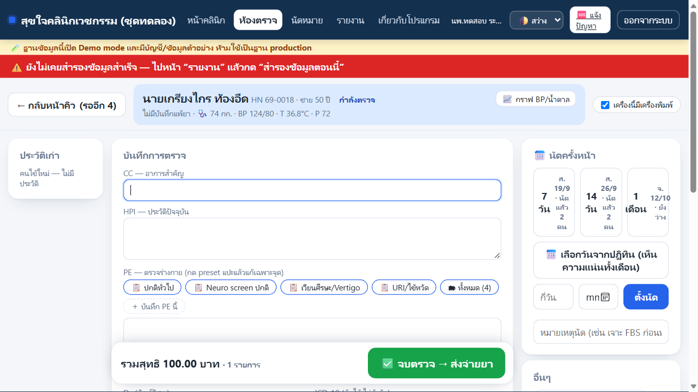
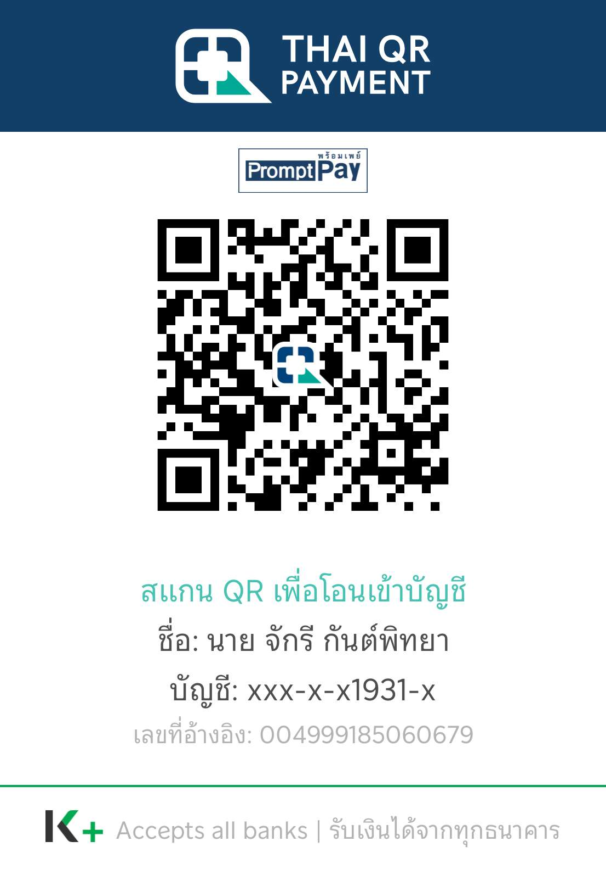

# ระบบคลินิก Offline

โปรแกรมบริหารคลินิกเวชกรรมขนาดเล็ก สำหรับคอมพิวเตอร์ในคลินิก (หมอทำคนเดียวในเครื่องเดียว หรือแยกหน้าร้าน + ห้องตรวจ) ใช้งานประจำวันโดยไม่ต้องมีอินเทอร์เน็ต ไม่มีค่ารายเดือน

เหมาะกับคลินิกขนาดเล็ก รองรับหมอหลายคนในเครือข่ายภายในเดียวกัน รับเงินสดหรือโอน **ไม่รองรับการเบิกประกันสังคม/บัตรทอง หลายสาขา หรือการทำงานบนคลาวด์** เริ่มด้วยชุดทดลองและข้อมูลสมมติก่อนเสมอ

## ดาวน์โหลดและเริ่มใช้

ต้องใช้ **Windows 10/11** และ Microsoft Edge หากใช้หลายเครื่อง ให้เครื่องห้องตรวจต่อเครือข่ายส่วนตัวเดียวกับเครื่องหลัก อินเทอร์เน็ตใช้ตอนดาวน์โหลด อัปเดต หรือส่งสำเนาเข้ารหัสขึ้นคลาวด์เท่านั้น

### [⬇ ดาวน์โหลดเพื่อทดลองใช้](https://github.com/mkungsuki/mk-artifacts/releases/latest/download/ClinicTrial-latest.zip)

**เริ่มจากปุ่มนี้ถ้าเพิ่งลองครั้งแรก** มีข้อมูลสมมติให้ฝึก ห้ามใส่ข้อมูลคนไข้จริง

### [⬇ ดาวน์โหลดเพื่อใช้งานจริง](https://github.com/mkungsuki/mk-artifacts/releases/latest/download/ClinicSetup-latest.zip)

สำหรับเริ่มใช้ที่คลินิก ฐานข้อมูลเริ่มว่าง

ทั้งสองปุ่มโหลด **รุ่นล่าสุดที่เผยแพร่แล้ว** ขนาดประมาณ **76 MB** มีส่วนประกอบครบ ไม่ต้องสมัคร GitHub หรือลง Git / Node.js เพิ่ม

ชื่อไฟล์ `latest` หมายถึงรุ่นล่าสุด ลิงก์นี้ใช้ต่อได้เมื่อมีรุ่นใหม่ **ไฟล์ที่ดาวน์โหลดเก็บไว้แล้วจะไม่เปลี่ยนตาม** หากเก็บไว้นานให้ดาวน์โหลดใหม่ หรืออัปเดตจากในโปรแกรมสำหรับเครื่องที่ติดตั้งแล้ว

### โหลดแล้วทำตามนี้

1. กด **ดาวน์โหลดเพื่อทดลองใช้** ด้านบน แล้วรอจนโหลดเสร็จ
2. ใน Edge กด **Ctrl+J** → **แสดงในโฟลเดอร์** เพื่อหาไฟล์ที่เพิ่งโหลด
3. ชุดทดลองชื่อ **ClinicTrial-latest.zip**; ชุดจริงชื่อ **ClinicSetup-latest.zip**
4. คลิกขวา ZIP → **แยกทั้งหมด (Extract All)** → เปิดโฟลเดอร์ที่แตกแล้ว
5. ดับเบิลคลิก **ติดตั้งระบบคลินิก.cmd** แล้วทำตามกล่องบนหน้าจอ

หากเบราว์เซอร์ขึ้นคำเตือน ให้ตรวจข้อความและแหล่งที่มาก่อน ไม่ปิดระบบป้องกันหรือกดผ่านทุกคำเตือน

อ่าน [คู่มือติดตั้งและหน้าร้าน](docs/คู่มือฉบับเต็ม-สำหรับหน้าร้านและผู้ดูแล.md) · [คู่มือแพทย์](docs/คู่มือฉบับเต็ม-สำหรับหมอ.md) · [แบบทดลอง](docs/แบบทดลองใช้-สำหรับหมอ.md)

**SmartScreen:** โปรแกรมไม่ได้ซื้อใบรับรองผู้เผยแพร่สำหรับ Windows จึงอาจขึ้นคำเตือน “Windows protected your PC” กด **ข้อมูลเพิ่มเติม (More info) → เรียกใช้ต่อไป (Run anyway)** เฉพาะไฟล์ที่ได้จากหน้าดาวน์โหลดทางการด้านบนและตรวจชื่อไฟล์แล้วเท่านั้น หากแหล่งที่มาไม่แน่ใจ ให้หยุด ไม่ต้องปิดระบบป้องกันไวรัส

## เครื่องที่ติดตั้งอยู่แล้ว

ใช้ **ผู้ดูแล → ระบบ / อัปเดตโปรแกรม → ตรวจหารุ่นใหม่** ไม่ลงตัวติดตั้งทับฐานข้อมูลเดิม หลังอัปเดตแล้ว ถ้าเห็นปุ่ม **อัปเดตส่วนประกอบ** ให้ทุกเครื่องหยุดใช้งานชั่วครู่และกดจากเครื่องหน้าร้าน ตัวช่วยจะเก็บสำเนาที่ตรวจแล้วก่อนเปลี่ยน

[ดูเลขรุ่นล่าสุดและสิ่งที่เพิ่ม](https://github.com/mkungsuki/mk-artifacts/releases/latest)

## คลังยาและการสั่งยาอ่านชัดขึ้น (เพิ่มในรุ่น 1.0.13)

ประวัติรับ–จ่ายยาเปิดเป็นหน้าต่างกลางจอ แยกคำเตือน **จำนวนยาใกล้หมด** ออกจาก **จำนวนวันก่อนหมดอายุ** และแสดงตัวเลขสัญญาณชีพชัดขึ้น ชุดทดลองมีล็อตตัวอย่างและตารางขนาดยาให้ฝึก โดยรักษารายการที่ผู้ใช้แก้เองไว้

แยก **หน่วยจ่าย** เช่น ขวด สำหรับราคา ต้นทุน และสต็อก จาก **หน่วยใช้ยา** เช่น มล. สำหรับเขียนวิธีใช้ มีช่องสั่งยาทุกกี่ชั่วโมง รวมช่วงเช่น4–6ชั่วโมง เมื่อหน่วยต่างกันหรือใช้ช่วงชั่วโมง ต้องกรอกจำนวนที่จะจ่ายเอง ระบบไม่คูณมล.เป็นจำนวนขวด คำสั่งยาและเอกสารที่บันทึกไว้แล้วไม่ถูกเปลี่ยนย้อนหลัง

## อ่านรายงานต้นทุนได้ชัดขึ้น (เพิ่มในรุ่น 1.0.12)

ยอดที่ยังไม่มีข้อมูลต้นทุนครบแสดง **—** พร้อมคำอธิบายรวมในแต่ละรายงาน กดดูชื่อยาและบริการที่ขาดต้นทุนได้ พร้อมทางไปตั้งค่าสำหรับใบเสร็จใหม่ ต้นทุนที่ทราบว่าเป็นศูนย์ยังแสดง **0.00** ยอดรายรับและใบเสร็จเก่าไม่เปลี่ยน

ข้อมูลทดลองที่สร้างใหม่ใช้ต้นทุนบริการที่ตั้งไว้แล้ว การเปลี่ยนต้นทุนในรายการบริการไม่เติมต้นทุนย้อนหลังให้ใบเสร็จเดิม

## กู้ด้วยรหัสและจัดการชุดทดลอง (เพิ่มในรุ่น 1.0.11)

ตั้ง **รหัสสำรองข้อมูลที่จำเองได้** เพื่อกู้จากโฟลเดอร์สำรองบนคลาวด์หรือ USB บนเครื่องใหม่ได้ USB กู้ฉุกเฉินเป็นทางเสริม เลือกตั้งเวลาสำรองและกดสำรองเองได้เหมือนเดิม

หลังอัปเดต ให้ผู้ดูแลเปิด **สำรองและกู้ข้อมูล → ตั้ง / เปลี่ยนรหัสสำรองข้อมูล → บันทึกรหัสและสำรองข้อมูล** ตรวจผลการส่งไฟล์และตรวจว่าไฟล์อัปโหลดถึงคลาวด์แล้ว จากนั้นซ้อมกู้ด้วยรหัส **การอัปเดตอย่างเดียวไม่ได้ตั้งรหัสให้ข้อมูลสำรองเดิม** อ่านขั้นตอนใน [คู่มือผู้ดูแล ข้อ 14](docs/คู่มือฉบับเต็ม-สำหรับหน้าร้านและผู้ดูแล.md#143-ตั้งรหัสสำรองข้อมูล-และ-usb-กู้เสริม)

ชุดทดลองมีปุ่ม **เริ่มฝึกใหม่** เพื่อล้างข้อมูลฝึกแล้วกลับไปใช้ข้อมูลสมมติเริ่มต้น และ **ถอนชุดทดลอง** เพื่อนำชุดทดลองออกจากเครื่อง อยู่ในบัญชีผู้ดูแลที่ **อัปเดตและเกี่ยวกับโปรแกรม → จัดการชุดทดลอง** ต้องกดจากเครื่องหลักของชุดทดลอง

รุ่นนี้รวมการตั้งค่าเริ่มต้นของยาเป็นตารางมื้อยา เมื่อสั่งยาต้องทวนขนาดยา มื้อยา จำนวนวัน และจำนวนจ่ายก่อนบันทึก

## หมอทำงานคนเดียว (เพิ่มในรุ่น 1.0.9)

ใช้คอมเครื่องเดียวและบัญชีแพทย์เดียวรับคนไข้ ตรวจ จัดยา และเก็บเงินได้ โดยเปิดสิทธิ์ครั้งเดียว:

1. เข้าบัญชี **ผู้ดูแล → ผู้ใช้งาน** แล้วเลือกบัญชีแพทย์ของตัวเอง
2. กด **ทำงานหน้าร้านด้วย: ปิดอยู่** อ่านรายการสิทธิ์แล้วกดยืนยัน
3. เข้าบัญชีแพทย์ใหม่ จะเห็น **แพทย์ + หน้าคลินิก** และเมนูคลังยา
4. รับคนไข้เข้าคิว → ตรวจและสั่งยา → **จบตรวจ → ไปเก็บเงิน** → ทวนรายการและยอดก่อนรับเงิน → เปิดใบเสร็จ → กลับห้องตรวจรับคนต่อไป

สิทธิ์นี้เริ่มปิดไว้และเปิดแยกเป็นรายคน ครอบคลุมงานหน้าร้าน เช่น จัดคลังยา เก็บเงิน แก้ใบเสร็จด้วยการยกเลิกและออกใหม่ และคืนเงิน บัญชีผู้ดูแลยังใช้แยกสำหรับตั้งค่าระบบ แพทย์ยังแก้เวชระเบียนของแพทย์อื่นไม่ได้

## ต้นทุนค่าบริการและหัตถการ (ตั้งแต่รุ่น 1.0.8)

ตั้งต้นทุนค่าบริการและหัตถการได้ที่ **คลังยา → ค่าบริการ / หัตถการ → แก้ราคา / ทุน** เช่น ค่าบริการ 300 บาท ต้นทุน 120 บาท รายงานแสดง **เหลือหลังต้นทุนตรง 180 บาท** ยังไม่หักค่าเช่า เงินเดือน และค่าใช้จ่ายประจำ หากยังไม่ได้ใส่ต้นทุน ระบบจะแจ้งว่าข้อมูลไม่ครบ ไม่เดาว่าเป็นศูนย์ และไม่เปลี่ยนต้นทุนในใบเสร็จเก่า

## ทำอะไรได้บ้าง

คิวหน้าร้านและห้องตรวจ เวชระเบียน สั่งยาด้วยตารางมื้อยา (dose grid) สต็อกยาและ LOT/วันหมดอายุ รับเงินและใบเสร็จ ใบรับรองแพทย์รวมแบบใบขับขี่ ใบนัด ปฏิทิน และรายงาน

ฉลากยาติดซองเปิดใช้ได้เอง รองรับ A4 2×5/3×8 และม้วนฉลากทดลอง พร้อมเตือนเมื่อข้อความล้น

สำรองข้อมูลเข้ารหัส กู้ด้วยรหัสสำรองที่ตั้งเองหรือ USB กู้ฉุกเฉินเสริม และตรวจลายเซ็นดิจิทัลก่อนติดตั้งรุ่นใหม่ ผู้ดูแลเป็นผู้ยืนยันอัปเดต (การกู้ด้วยรหัสเริ่มในรุ่น 1.0.11; รุ่นเก่าใช้ Recovery Kit)

ภาพต่อไปนี้สร้างจาก `seed-mock-clinic.js` ในฐานข้อมูลชั่วคราว ทุกชื่อและรายการเป็นข้อมูลสมมติ:

## ข้อมูลและการรับผิดชอบ

ฐานข้อมูลอยู่ที่เครื่องหลักในคลินิก ใช้คนเดียวในเครื่องเดียวได้ หากแยกเครื่องห้องตรวจจะเชื่อมผ่าน HTTPS ภายในคลินิก ผู้พัฒนาไม่มีช่องทางเข้าดูคนไข้ ไม่มีระบบส่งสถิติการใช้งานกลับผู้พัฒนา (telemetry) หากคลินิกตั้งสำรองขึ้น Google Drive/OneDrive จะส่งเฉพาะไฟล์สำรองเข้ารหัสผ่านบัญชีของคลินิกเอง

**รหัสสำรองเป็นของคลินิก หากลืมรหัส เครื่องเดิมใช้ไม่ได้ และไม่มี USB กู้ฉุกเฉินที่ใช้ได้ ผู้พัฒนากู้ข้อมูลเข้ารหัสให้ไม่ได้** เลือกจำ จด หรือเก็บรหัสในโปรแกรมจัดการรหัสตามสะดวก เมื่อเครื่องเดิมยังใช้ได้สามารถตั้งรหัสใหม่ได้ USB กู้ฉุกเฉินเป็นทางเสริม ให้เก็บแยกจากคอมพิวเตอร์และ USB สำรอง ซ้อมกู้ด้วยรหัสและข้อมูลสำรองให้ครบก่อนใช้ข้อมูลจริง

ซอฟต์แวร์แจกตามสภาพ ไม่มีการรับประกัน ตามขอบเขตที่กฎหมายอนุญาตใน [LICENSE ข้อ 15–16](LICENSE) คลินิกมีหน้าที่ในฐานะผู้ควบคุมข้อมูลส่วนบุคคลตาม PDPA และต้องจัดการสิทธิ์ การเก็บรักษา และความปลอดภัยของข้อมูลตนเอง

โปรแกรมนี้ใช้จัดการงานและเอกสารคลินิก ไม่ใช่เครื่องมือวินิจฉัยหรือรักษาโรค ไม่ทดแทนดุลยพินิจแพทย์ และไม่ใช่การรับรองสถานะเครื่องมือแพทย์ตามกฎหมาย ต้องทวนยา ขนาดยา และเอกสารก่อนใช้จริง

## สนับสนุนตามศรัทธา

ไม่บังคับ ไม่มีฟีเจอร์ล็อก การไม่บริจาคไม่เปลี่ยนสิทธิ์การใช้งาน

## แจ้งปัญหา

ใช้ [GitHub Issues](https://github.com/mkungsuki/clinic-offline/issues) เท่านั้น ตอบเมื่อผู้พัฒนาว่าง ไม่รับประกันเวลาตอบ ไม่ใช่บริการฉุกเฉิน หากระบบขัดข้องให้ใช้แผนสำรองของคลินิก

ห้ามแนบข้อมูลคนไข้จริง กุญแจกู้ รหัสผ่าน หรือฐานข้อมูล ใช้ข้อมูลสมมติในภาพ และตรวจชื่อผู้ใช้ ชื่อเครื่อง ที่อยู่โฟลเดอร์ในรายงานปัญหาก่อนเผยแพร่ อ่าน [แนวทางแจ้งปัญหา](CONTRIBUTING.md)

## สัญญาอนุญาต

[AGPL-3.0-only](LICENSE): ใช้และแก้ไขได้ รวมถึงใช้เชิงพาณิชย์ การแจกจ่ายต้องปฏิบัติตามเงื่อนไขการให้ซอร์สโค้ดและสัญญาอนุญาต หากแก้โปรแกรมแล้วให้ผู้ใช้โต้ตอบผ่านเครือข่าย ต้องเสนอซอร์สโค้ดของรุ่นที่แก้ไขนั้นแก่ผู้ใช้ตามข้อ 13 ไม่ได้บังคับเผยแพร่ข้อมูลคนไข้หรือฐานข้อมูล

หากต้องการเงื่อนไขใช้งานแบบไม่เปิดซอร์สที่ AGPL กำหนด ติดต่อเจ้าของลิขสิทธิ์ผ่าน issue เพื่อพิจารณาสัญญาอนุญาตอื่น **ไม่รับ pull request** ดูเหตุผลใน CONTRIBUTING
