# คู่มือระบบคลินิกสำหรับหน้าร้านและผู้ดูแล

ฉบับทำตามได้เลย · ติดตั้ง รับคนไข้ คิดเงิน คลัง รายงาน สำรองและกู้ข้อมูล  
ฉบับเตรียมสำหรับ 1.0.7 · 14 กันยายน 2569 · ยังไม่เผยแพร่

> คู่มือนี้ออกแบบให้หมอและหน้าร้านติดตั้งเองได้ทั้งหมดโดยไม่ต้องให้ใครรีโมทเข้าคอมพิวเตอร์ ทำตามทีละข้อและถ่ายภาพหน้าจอไว้เมื่อพบข้อความไม่ตรงกับคู่มือ

[[toc]]

## 1. เตรียมก่อนวันติดตั้งตัวจริง

- USB สำหรับเก็บสำเนาเพิ่มหรือทำ USB กู้ฉุกเฉินเป็นทางเลือกเสริม หากใช้ทั้งสองอย่างให้ใช้คนละอัน
- บัญชี Google ของคลินิก หรือบัญชี Microsoft ที่จะใช้เก็บข้อมูลสำรองบนคลาวด์
- เครื่องต่ออินเทอร์เน็ตได้ในวันติดตั้ง เพื่อดาวน์โหลดชุดติดตั้งและให้ Google Drive/OneDrive ซิงก์ข้อมูลสำรอง
- ชื่อคลินิก ที่อยู่ เบอร์โทร เลขใบอนุญาต เลขใบประกอบวิชาชีพ และข้อมูลภาษาอังกฤษถ้าจะออกเอกสารอังกฤษ
- รายการยา ราคา และทุน ถ้ามีไฟล์ CSV เตรียมไว้ได้

วันติดตั้ง หมอทำตามคู่มือนี้ทีละขั้น: ติดตั้ง ตั้งเครื่องพิมพ์ ตั้งข้อมูลสำรอง ตั้งรหัสสำรองและซ้อมกู้เอง จะทำ USB กู้ฉุกเฉินเพิ่มก็ได้ หากติดขัดให้ถ่ายภาพทั้งหน้าจอส่งกลับโดย **ห้ามถ่ายหรือส่งรหัสหรือกุญแจเข้ารหัสเต็ม** หมอเป็นคนพิมพ์และเก็บรหัสจริงเอง

## 2. ติดตั้งเองจาก ZIP: ทำทีละภาพ

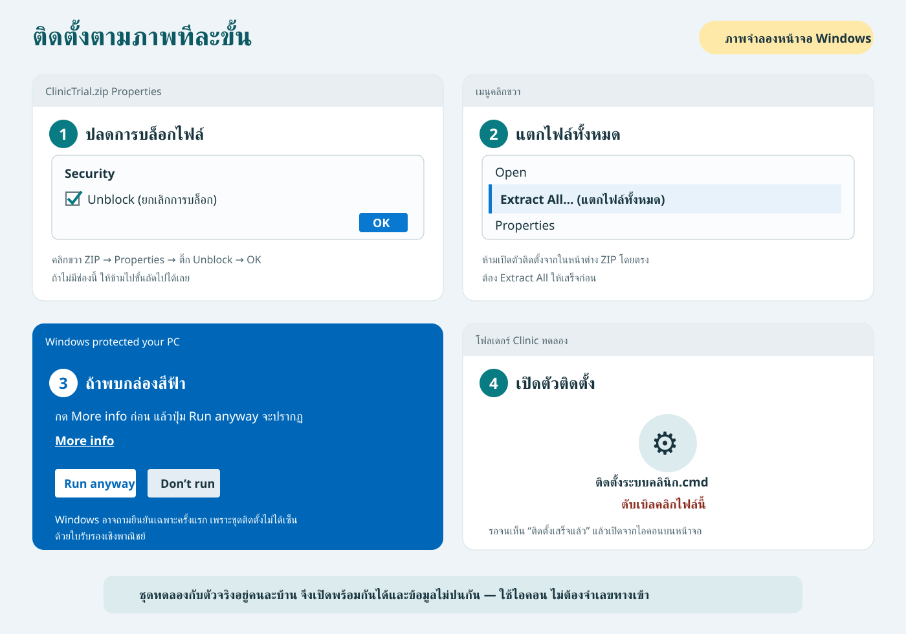

1. คลิกขวาไฟล์ ZIP → **Properties** หากเห็น **Unblock** ให้ติ๊กแล้วกด OK
2. คลิกขวา ZIP → **Extract All** ห้ามเปิดตัวติดตั้งจากใน ZIP โดยตรง
3. เปิดโฟลเดอร์ที่แตกแล้ว จะเห็น 3 รายการ ดับเบิลคลิก **ติดตั้งระบบคลินิก.cmd** (ไฟล์เดียวที่ต้องกด) โฟลเดอร์ **ชุดโปรแกรม (ไม่ต้องเปิด)** ไม่ต้องเปิด
4. ถ้า Windows ขึ้นกล่องสีฟ้า ให้กด **More info** แล้ว **Run anyway**
5. รอจนเห็น “ติดตั้งเสร็จแล้ว” แล้วเปิดจากไอคอนบนหน้าจอ

จุดที่คนมักพลาด: ถ้าขึ้นว่า “ไม่พบไฟล์โปรแกรมข้าง ๆ ตัวติดตั้ง” แปลว่ายังไม่ได้ Extract All ให้ปิดหน้าต่างนั้นแล้วกลับไปข้อ 2

## 3. ชุดทดลองกับตัวจริง

| ชุด | โฟลเดอร์ | ไอคอน | สิ่งที่เห็น |
|---|---|---|---|
| ทดลอง | `C:\clinic-trial` | ระบบคลินิก (ทดลอง) | แถบเหลือง “ข้อมูลตัวอย่าง ห้ามใช้เป็นฐานจริง” |
| ตัวจริง | `C:\clinic` | ระบบคลินิก | ไม่มีคนไข้ติดมา เริ่มว่าง |

ให้ฝึกจาก **ระบบคลินิก (ทดลอง)** ก่อน เมื่อพร้อมใช้จริง เปิดตัวติดตั้งชุดจริง จะขึ้นกล่องยืนยัน **ลบชุดทดลองและข้อมูลทั้งหมดที่เคยกรอกในชุดนั้นอย่างถาวร** แล้วจึงติดตั้งตัวจริงเป็นฐานว่าง ข้อมูลฝึกจะไม่ย้ายตามมา ถ้ายังมีข้อมูลต้องเก็บ ให้กด **ไม่ใช่** หรือปิดกล่องเพื่อหยุดการติดตั้งโดยไม่ลบ

เมื่อติดตั้งจริงสำเร็จ ปิดแท็บทดลองเดิมและเลิกใช้ Bookmark ทดลอง เปิดไอคอน **ระบบคลินิก** แล้วตั้งบัญชี คลินิก ยา เครื่องพิมพ์ และข้อมูลสำรองใหม่ ถ้าใช้สองเครื่อง ให้ตั้งค่าเครื่องห้องตรวจของตัวจริงใหม่และเปลี่ยนทางเข้าที่เครื่องหมอด้วย ถ้าลบชุดทดลองไม่สำเร็จ ตัวติดตั้งจะหยุดไว้ ให้เปิดตัวติดตั้งอีกครั้งเพื่อทำต่อ ไม่ต้องลบโฟลเดอร์เอง

ทางเข้าเครื่องหมอของชุดทดลองอยู่ในโฟลเดอร์ **ส่งไปเครื่องหมอ (ทดลอง)** ใช้ทางลัด **เปิดระบบคลินิก (ห้องหมอ ทดลอง)** ส่วนตัวจริงใช้ **ส่งไปเครื่องหมอ** และ **เปิดระบบคลินิก (ห้องหมอ)** ภาพขั้นตอนด้านล่างใช้ชื่อของตัวจริง

> ห้ามนำฐานข้อมูล โฟลเดอร์ data หรือข้อมูลคนไข้จากชุดทดลองไปวางในตัวจริง และห้ามกรอกข้อมูลคนไข้จริงในชุดทดลอง

## 3A. เชื่อมคอมพิวเตอร์ห้องตรวจ (ทดลองสองเครื่อง) — ทำ 4 ขั้นตามลำดับ

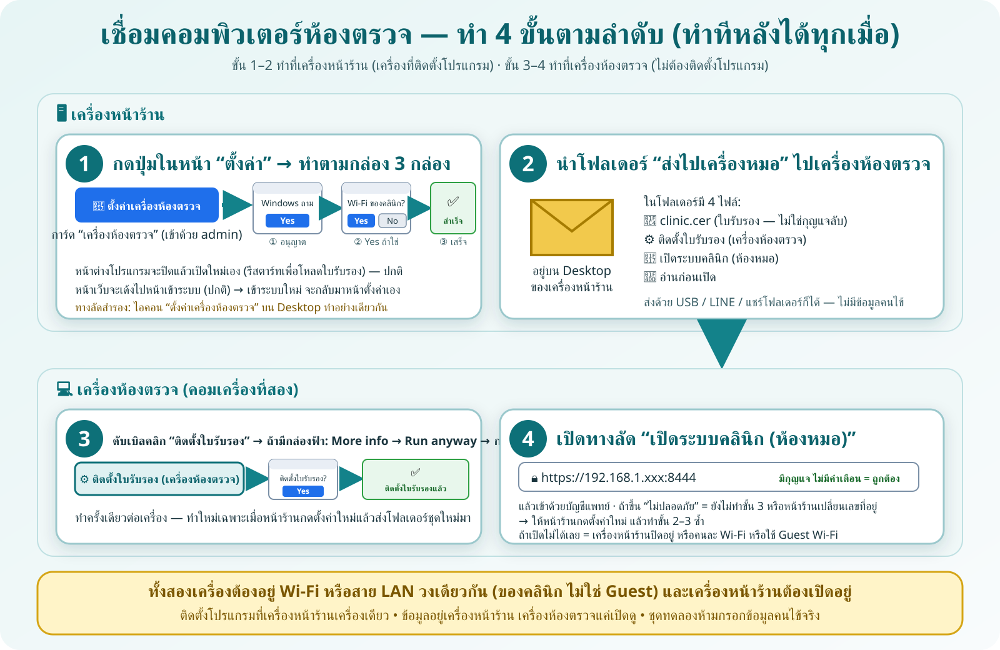

ใช้วิธีนี้เมื่อต้องการให้หน้าร้านและแพทย์ลองทำงานพร้อมกัน คอมพิวเตอร์ทั้งสองเครื่องต้องต่อ Wi-Fi หรือสาย LAN วงเดียวกัน และต้องติดตั้ง Clinic Trial **ที่เครื่องหน้าร้านเพียงเครื่องเดียว** — **ทำทีหลังได้ทุกเมื่อ** ไม่จำเป็นต้องทำตอนติดตั้ง และทำซ้ำได้เสมอ (เช่น หลังเปลี่ยน Wi-Fi/เราเตอร์)

**จำลำดับ:** ขั้น 1–2 ทำที่เครื่องหน้าร้าน → ขั้น 3–4 ทำที่เครื่องห้องตรวจ · การ์ด **เครื่องห้องตรวจ** ในหน้าตั้งค่าจะบอกว่าตอนนี้ถึงขั้นไหนแล้ว

### ขั้น 1 — ที่เครื่องหน้าร้าน: กดปุ่มในหน้าตั้งค่า แล้วทำตามกล่อง

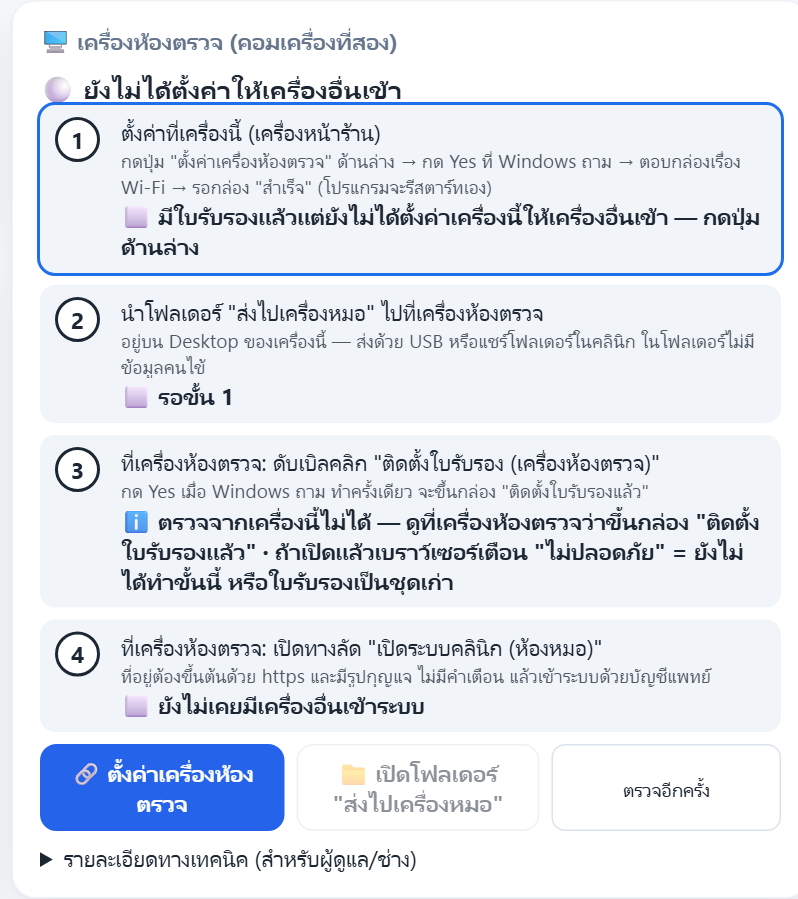

1. เข้าระบบด้วยบัญชี `admin` ที่เครื่องหน้าร้าน → เมนู **ตั้งค่า** → การ์ด **🖥️ เครื่องห้องตรวจ (คอมเครื่องที่สอง)** อยู่ด้านขวาบน
2. กดปุ่ม **🔗 ตั้งค่าเครื่องห้องตรวจ** — จะมีหน้าต่างและกล่องเด้งขึ้นตามลำดับนี้ (กดตอบไปตามลำดับ ไม่ต้องพิมพ์อะไร):
   - **กล่องที่ 1** Windows ถามว่าจะอนุญาตให้เปลี่ยนแปลงเครื่องหรือไม่ → กด **Yes**
   - **กล่องที่ 2** (เครื่องส่วนใหญ่จะเจอ) ถามว่าเครือข่ายที่ต่ออยู่เป็น Wi-Fi/สาย LAN ของคลินิกที่ไว้ใจหรือไม่ → ถ้าใช่กด **Yes** · ถ้าเป็น Wi-Fi สาธารณะหรือไม่แน่ใจกด **No** แล้วหยุดปรึกษาผู้ดูแลก่อน
   - ระหว่างนี้หน้าต่างโปรแกรมสีดำจะปิดแล้วเปิดใหม่เอง (รีสตาร์ทเพื่อโหลดใบรับรอง) — **เป็นเรื่องปกติ** ไม่ต้องกดอะไร
   - **กล่องที่ 3** สีเขียว **ตั้งค่าสองเครื่องสำเร็จแล้ว** บอกลิงก์เครื่องห้องตรวจและที่อยู่โฟลเดอร์ → กด OK
3. **หน้าเว็บจะเด้งไปหน้าเข้าระบบ** (เพราะโปรแกรมรีสตาร์ท ทุกคนต้องเข้าระบบใหม่ — หน้านั้นจะมีแถบเหลืองบอกว่าเป็นเรื่องปกติ) → เข้าด้วย `admin` อีกครั้ง → ระบบพากลับมาหน้าตั้งค่าเอง

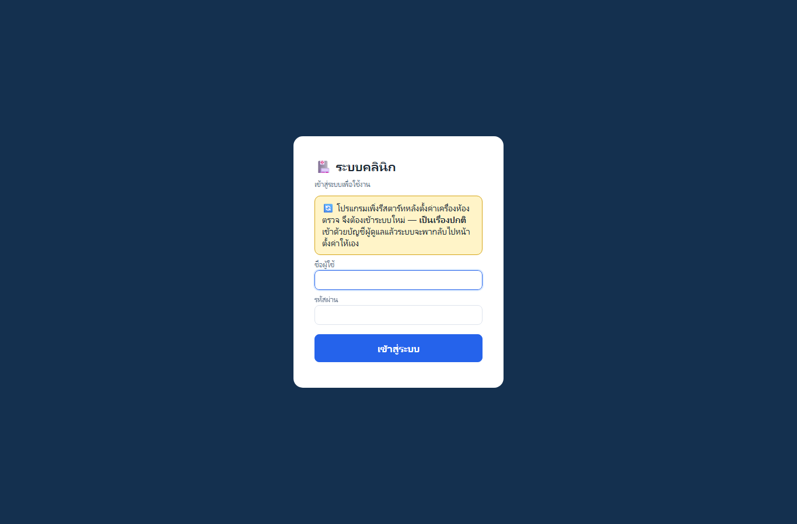

4. การ์ดจะเปลี่ยนเป็น **🟢 เครื่องนี้พร้อมให้เครื่องห้องตรวจเข้าแล้ว** และขั้น 1–2 ขึ้นเครื่องหมาย ✅/📁 (ถ้าไม่เปลี่ยนให้กด **ตรวจอีกครั้ง**)
   ถ้าขึ้นกล่องสีแดง **ตั้งค่าไม่สำเร็จ** ให้ถ่ายภาพกล่องนั้นส่งผู้ดูแล รายละเอียดทั้งหมดอยู่ที่ `C:\clinic-trial\logs\setup-lan.log`

> ภาพจริงจาก Windows ที่รอเพิ่มในคู่มือ: `19-uac-yes.png` (กล่องแรก), `20-wifi-private-confirm.png` (กล่อง Wi-Fi ถ้ามี) และ `21-lan-success-green.png` (กล่องสำเร็จ) — ถ้าหน้าจอที่เห็นไม่ตรง ให้ถ่ายภาพส่งกลับก่อนกดต่อ

> ทางลัดสำรอง: ไอคอน **ตั้งค่าเครื่องห้องตรวจ (ทดลอง)** บน Desktop ของเครื่องหน้าร้านทำอย่างเดียวกัน (ใช้เมื่อเปิดหน้าตั้งค่าไม่ได้) · ถ้าเผลอดับเบิลคลิกไฟล์ที่อยู่ในโฟลเดอร์ที่แตก ZIP ระบบจะพาไปทำที่ `C:\clinic-trial` ให้เอง

### ขั้น 2 — ที่เครื่องหน้าร้าน: นำโฟลเดอร์ "ส่งไปเครื่องหมอ" ไปเครื่องห้องตรวจ

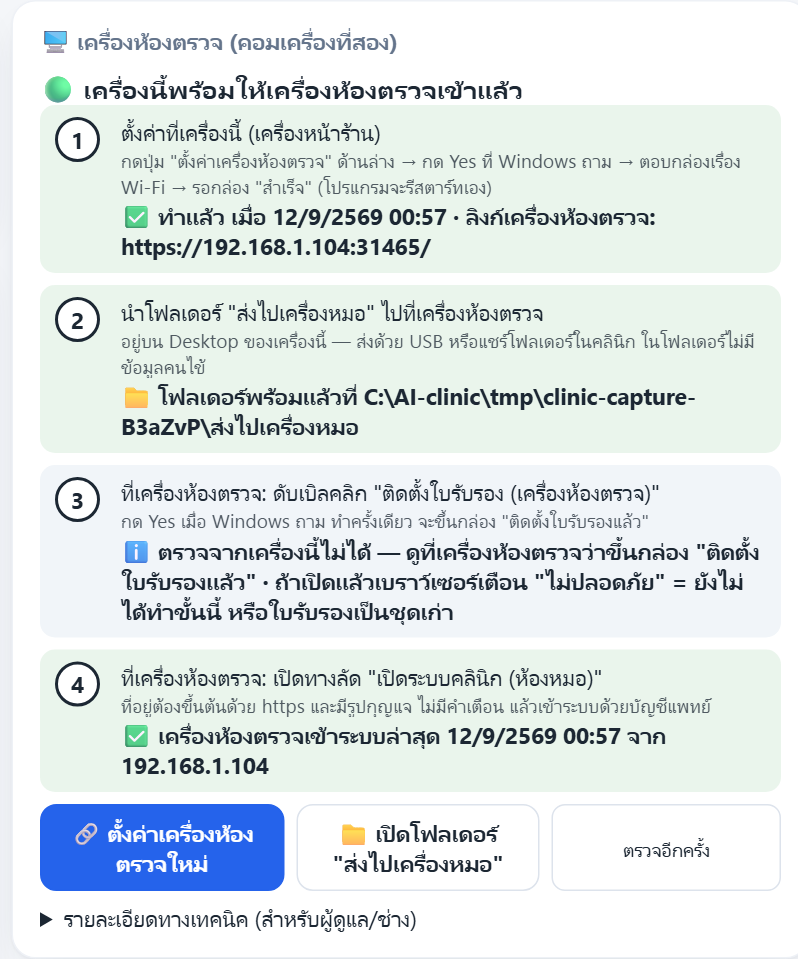

1. กดปุ่ม **📁 เปิดโฟลเดอร์ "ส่งไปเครื่องหมอ"** ในการ์ด (หรือเปิดจาก Desktop ของเครื่องหน้าร้าน)
2. ในโฟลเดอร์มี 4 ไฟล์: `clinic.cer` (ใบรับรอง — ไม่ใช่กุญแจลับ), **ติดตั้งใบรับรอง (เครื่องห้องตรวจ)**, **เปิดระบบคลินิก (ห้องหมอ)**, **อ่านก่อนเปิด** — **ไม่มีฐานข้อมูลคนไข้**
3. คัดลอกทั้งโฟลเดอร์ไปเครื่องห้องตรวจด้วย USB, แชร์โฟลเดอร์ก็ได้

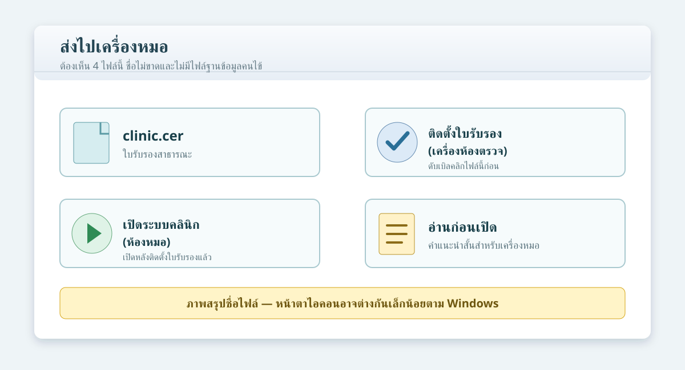

### ขั้น 3 — ที่เครื่องห้องตรวจ: ติดตั้งใบรับรอง (ทำครั้งเดียว)

1. เปิดโฟลเดอร์ **ส่งไปเครื่องหมอ** ที่คัดลอกมา → ดับเบิลคลิก **ติดตั้งใบรับรอง (เครื่องห้องตรวจ)**
2. ถ้าส่งโฟลเดอร์มาทางอินเทอร์เน็ต Windows อาจขึ้นกล่องสีฟ้า **Windows protected your PC** → กด **More info** → ตรวจว่าชื่อไฟล์คือ **ติดตั้งใบรับรอง (เครื่องห้องตรวจ)** → กด **Run anyway** (ถ้ามาทาง USB มักไม่เห็นกล่องนี้)
3. Windows ถามยืนยันการติดตั้ง → กด **Yes** → รอจนเห็นกล่อง **ติดตั้งใบรับรองแล้ว** แล้วกด OK (ถ้าขึ้น "ไม่สำเร็จ" ให้ดับเบิลคลิกใหม่แล้วกด Yes)
4. ทำครั้งเดียวต่อเครื่อง — ทำใหม่เฉพาะเมื่อหน้าร้านกดตั้งค่าใหม่แล้วส่งโฟลเดอร์ชุดใหม่มา (การ์ดที่หน้าร้านจะบอกเองว่า "ต้องทำใหม่")

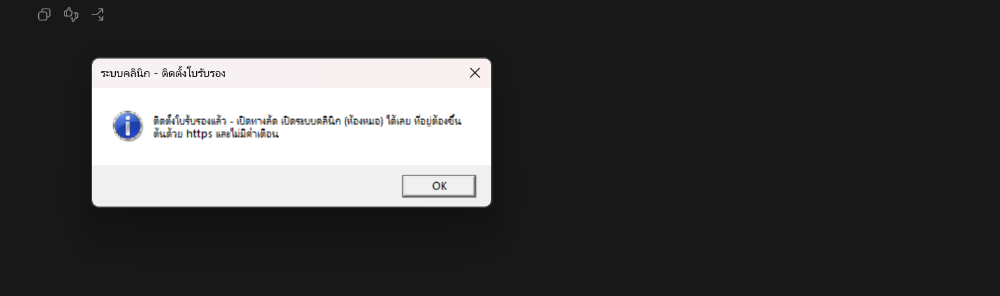

เมื่อเห็นกล่องนี้ กด OK แล้วเปิดทางลัดในขั้น 4 ภาพนี้มาจากการติดตั้งชุดทดลองด้วยข้อมูลสมมติ

> ภาพจริงจาก Windows ที่รอเพิ่มในคู่มือ: `23-smartscreen-more-info.png` และ `24-certificate-confirm-yes.png`

### ขั้น 4 — ที่เครื่องห้องตรวจ: เปิดทางลัดแล้วเข้าระบบ

1. ดับเบิลคลิก **เปิดระบบคลินิก (ห้องหมอ)** — ที่อยู่ในเบราว์เซอร์ต้องขึ้นต้นด้วย `https` มีรูปกุญแจ และ**ไม่มีคำเตือน**
2. เข้าด้วย `doctor` / `doctor123` ส่วนเครื่องหน้าร้านใช้ `front` / `front123`
3. ลองให้หน้าร้านลงทะเบียนหรือเข้าคิว แล้วดูว่าชื่อสมมติปรากฏที่เครื่องหมอ จากนั้นให้หมอกดเรียกคิวและดูข้อความที่เครื่องหน้าร้าน — เมื่อเครื่องห้องตรวจเข้าระบบได้แล้ว การ์ดที่หน้าร้านจะขึ้นขั้น 4 เป็น ✅ พร้อมเวลาที่เข้า

> จำง่าย ๆ: หน้าร้านคือ “บ้านของข้อมูล” เครื่องหมอเป็นเพียงหน้าต่างที่เปิดเข้ามาดู ถ้าปิดเครื่องหน้าร้าน เครื่องหมอจะเข้าไม่ได้

### ถ้ามีปัญหา — ดูที่การ์ดก่อน

| อาการ | ความหมาย | ทำอย่างไร |
|---|---|---|
| เครื่องหมอเตือน “ไม่ปลอดภัย/ใบรับรองไม่ถูกต้อง” | ยังไม่ทำขั้น 3 หรือใบรับรองเป็นชุดเก่า (หน้าร้านเปลี่ยน Wi-Fi/เราเตอร์) | ดูการ์ดที่หน้าร้าน ถ้าขึ้น 🟡 “ต้องตั้งค่าใหม่” ให้กด **ตั้งค่าเครื่องห้องตรวจใหม่** แล้วทำขั้น 2–3 ซ้ำ |
| เครื่องหมอเปิดไม่ได้เลย (หมุนค้าง/ต่อไม่ได้) | เครื่องหน้าร้านปิดอยู่ · คนละ Wi-Fi · ใช้ Guest Wi-Fi · หรือ Firewall ยังไม่เปิดช่องทาง | เช็คตามลำดับนั้น แล้วดูการ์ด ถ้าขึ้น 🟡 เรื่อง Firewall ให้กดตั้งค่าใหม่ |
| การ์ดขึ้น ⚪ “ยังไม่ได้ตั้งค่า” ทั้งที่เคยทำแล้ว | ติดตั้งโปรแกรมใหม่/ย้ายเครื่อง | ทำขั้น 1–3 ใหม่ทั้งหมด |
| ปุ่มตั้งค่ากดไม่ได้ | กำลังเปิดหน้าตั้งค่าจากเครื่องห้องตรวจ | ปุ่มนี้กดได้จากเครื่องหน้าร้านเท่านั้น (การ์ดจะบอกเหตุผลใต้ปุ่ม) |

เมื่อต้องการปิดทางเข้า ให้ดับเบิลคลิก **ปิดการเชื่อมสองเครื่อง (ทดลอง)** ที่ `C:\clinic-trial` ของเครื่องหน้าร้าน โปรแกรมและข้อมูลทดลองจะยังอยู่เหมือนเดิม

การเชื่อมสองเครื่องรับส่งข้อมูลแบบเข้ารหัส (https) และเครื่องอื่นเข้าได้เฉพาะทางนี้ ชุดใช้งานจริงมีการ์ดและตัวช่วยชื่อเดียวกัน ทำงานเหมือนกัน — ใช้กับ Wi-Fi/สาย LAN ของคลินิกที่คนไข้ไม่ได้รหัสเท่านั้น ห้ามกรอกหรือส่งข้อมูลคนไข้จริงผ่านชุดทดลอง

## 4. เข้าใช้และสิทธิ์

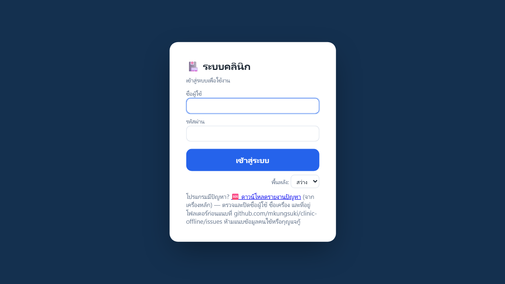

บัญชีชุดทดลอง: หน้าร้าน `front` / `front123`, แพทย์ `doctor` / `doctor123`, ผู้ดูแล `admin` / `admin1234`

| งาน | หน้าร้าน | แพทย์ | ผู้ดูแล |
|---|:---:|:---:|:---:|
| ลงทะเบียน แก้ข้อมูล วัด vitals เข้าคิว | ✓ | - | - |
| เรียกตรวจ note สั่งยา นัด ใบรับรอง | - | ✓ | - |
| จ่ายยา คิดเงิน เอกสารย้อนหลัง | ✓ | ดูประวัติ | - |
| คลังยา/บริการ/CSV/รับเข้า/ปรับยอด | ✓ | - | - |
| ปฏิทินและรายงาน | ✓ | ✓ | - |
| ตั้งคลินิก ผู้ใช้ สำรอง กู้ รวม HN ซ้ำ | - | - | ✓ |

ผู้ดูแลเห็นเฉพาะหน้าตั้งค่าโดยตั้งใจ หากต้องช่วยหน้าร้านให้ใช้บัญชี front ไม่ควรใช้ admin ทำงานประจำวัน

## 5. หน้าร้าน: อ่านคิวสามสถานี

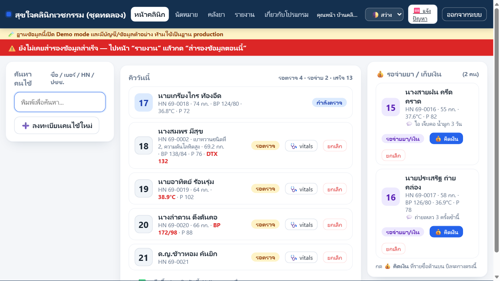

- กลาง: รอตรวจและกำลังตรวจ คนที่กำลังตรวจจะปักอยู่ด้านบน
- ขวา: รอจ่ายยา/เก็บเงิน อยู่ใกล้กล่องคิดเงิน ไม่ถูกคิวยาวดันลงล่าง
- เสร็จสิ้น/ยกเลิกวันนี้: พับไว้ กดเพื่อเปิดย้อนหลัง
- ตัวเลขสีแดง เช่น ไข้ 38.9 หรือ BP 172/98 ช่วยให้เห็นคนที่ควรแจ้งแพทย์ทันที ไม่ใช่การวินิจฉัยอัตโนมัติ

เมื่อแพทย์กดเรียกตรวจ หน้าร้านจะขึ้นข้อความ “หมอเรียกคิวที่ ...” และการ์ดกะพริบช่วงสั้น ๆ

## 6. ค้นคนไข้เก่าและลงทะเบียนคนใหม่

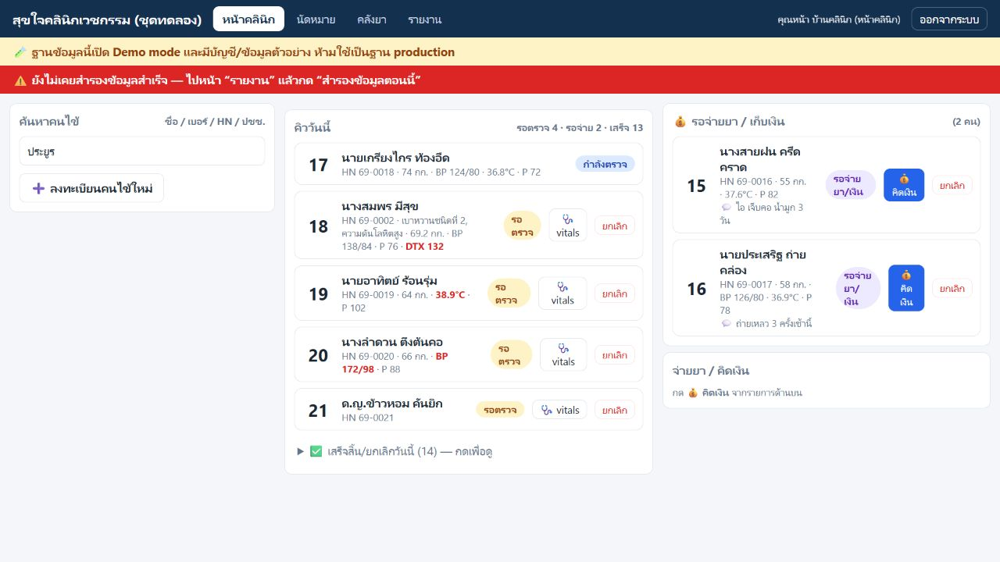

พิมพ์ชื่อบางส่วน นามสกุล เบอร์ HN หรือเลขประชาชนในช่องค้นหา หากพบคนไข้ให้คลิกชื่อเพื่อเปิดการ์ด ห้ามลงทะเบียนซ้ำเพราะสะกดต่างกันเล็กน้อยโดยไม่ค้นก่อน

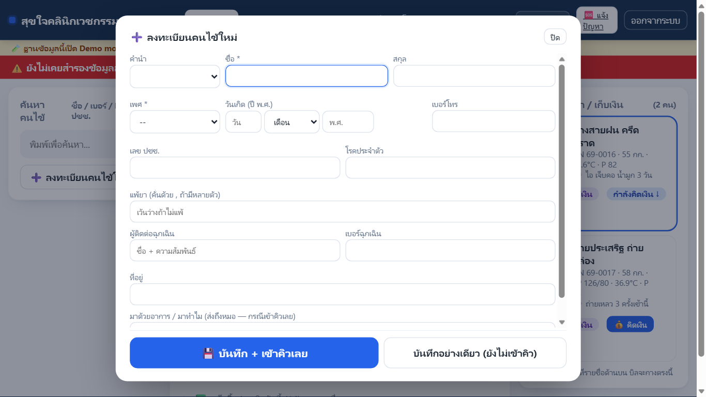

การลงทะเบียนบังคับเพียงชื่อและเพศ วันเกิดใช้วัน/เดือน/ปี **พ.ศ.** และจะแสดงอายุให้ตรวจทันที

ขั้นตอน walk-in:

1. กด **ลงทะเบียนคนไข้ใหม่**
2. กรอกชื่อ เพศ และข้อมูลที่มี ไม่ต้องชะลอคิวเพื่อกรอกทุกช่อง
3. ช่อง **มาด้วยอาการ/มาทำไม** เช่น “ไข้ ไอ 2 วัน” จะส่งไปช่อง CC ของแพทย์
4. เลือก **บันทึก + เข้าคิวเลย** หรือ **บันทึกอย่างเดียว**
5. ตรวจว่าชื่อ HN และอายุถูกก่อนวัดสัญญาณชีพ

หากข้อมูลเดิมผิด กดแก้ข้อมูล จะเห็นฟอร์มเต็มพร้อมค่าเดิม หากพบ HN ซ้ำจริง ให้ผู้ดูแลใช้ “รวมคนไข้ซ้ำ” โดยเลือก HN หลัก ประวัติเก่ายังอยู่และตรวจย้อนกลับได้

## 7. วัดสัญญาณชีพและจัดคิว

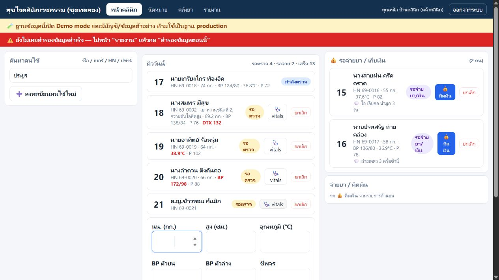

กด **vitals** ที่การ์ดคนไข้ ใส่น้ำหนัก ส่วนสูง อุณหภูมิ BP ชีพจร และ DTX เท่าที่วัด แล้วกดบันทึก ค่าเก่าจากครั้งก่อนอาจแสดงให้เทียบ แต่ต้องบันทึกค่าครั้งนี้ตามที่วัดจริง

การยกเลิกคิวต้องใส่เหตุผล เช่น “กลับก่อน” หรือ “มาผิดวัน” ยกเลิกไม่ได้แปลว่าลบ คนไข้ยังอยู่และเหตุผลแสดงในรายการวันนี้

## 8. จ่ายยาและคิดเงิน

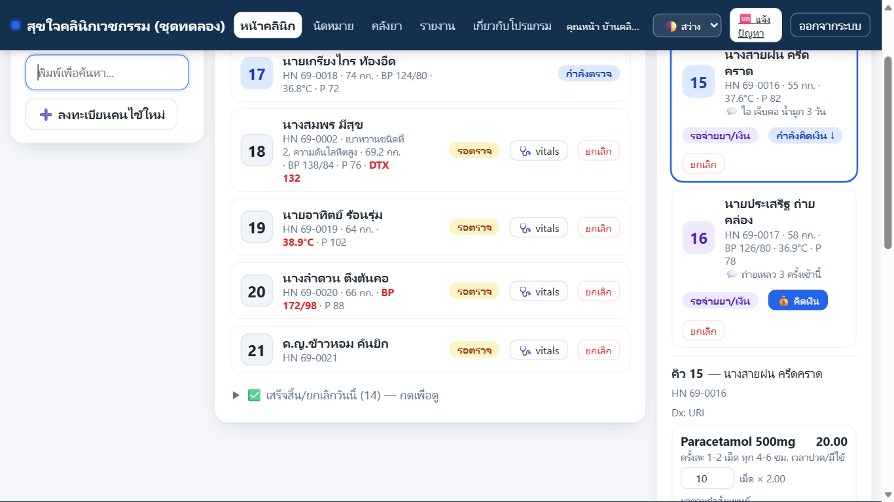

1. กด **คิดเงิน** ที่คนรอจ่าย
2. ทวนชื่อคนไข้ Dx ยา วิธีใช้ จำนวน ค่าบริการ ส่วนลด และยอดสุทธิ
3. รายการยาจากคำสั่งแพทย์แก้ชื่อ/ราคาไม่ได้ที่หน้าร้าน หากจำนวนจ่ายจริงต่าง ให้แก้จำนวน ระบบจะสร้าง order รุ่นใหม่และเก็บรุ่นเดิม
4. เพิ่มค่าบริการอื่นได้จากช่องค้นหา
5. ถ้าเพิ่มส่วนลด ต้องใส่เหตุผล
6. เลือกเงินสดหรือโอน เงินสดใส่ยอดรับเพื่อดูเงินทอน โอนใส่เลขอ้างอิงหรือข้อความที่คลินิกใช้ตรวจ
7. กด **รับเงิน + พิมพ์ใบเสร็จ** แล้วตรวจชื่อ ยอด และกระดาษ A5

ถ้ามีนัด กล่องนัดสีน้ำเงินจะปรากฏ ให้พิมพ์ใบนัดและทวนวันกับคนไข้ก่อนกลับ

ถ้าหมอออกใบรับรองไว้ จะมีกล่อง **📄 เอกสารของ visit นี้** อยู่เหนือปุ่มรับเงิน ให้พิมพ์ก่อนส่งคนไข้กลับ (ดูหัวข้อ 8A)

จุดที่คนมักพลาด: อย่ากดรับเงินก่อนทวนคนไข้และยอด ใบเสร็จที่ออกแล้วแก้ตรง ๆ ไม่ได้

## 8A. พิมพ์ใบรับรองที่หมอออกไว้

เครื่องพิมพ์อยู่ที่หน้าร้านเครื่องเดียว หมอในห้องตรวจสั่งพิมพ์เองไม่ได้ หน้าร้านจึงเป็นคนพิมพ์เอกสารทุกใบ

**สังเกตป้ายสีเหลือง** เมื่อหมอออกใบรับรองให้คนไข้ ระบบจะเด้งข้อความบอกว่า “หมอออกใบรับรองให้คิวที่ ...” และขึ้นป้าย **🖨️ ใบรับรอง MC…-…. รอพิมพ์** บนการ์ดคิวของคนไข้คนนั้น

ทำอย่างนี้:

1. กดที่ป้ายสีเหลืองบนคิว หรือกด **คิดเงิน** แล้วดูกล่อง **📄 เอกสารของ visit นี้**
2. หน้าพิมพ์จะเปิดขึ้นที่เครื่องนี้ กดพิมพ์ตามปกติ
3. ถ้ามีหลายใบค้าง (ใบรับรอง + ใบนัด) กด **🖨️ พิมพ์ทั้งหมดที่ค้าง** ครั้งเดียว ระบบเปิดให้ทีละแท็บ
4. **เอากระดาษไปให้หมอเซ็นและปั๊มตราคลินิกก่อนส่งคนไข้เสมอ** ใบที่ยังไม่เซ็นใช้ไม่ได้
5. เมื่อพิมพ์แล้วป้ายจะหายเอง ถ้าป้ายยังอยู่แปลว่ายังไม่ได้พิมพ์จริง

ถ้าป้ายเขียนว่า **(หมอเปิดดูแล้ว)** แปลว่าหมอกดดูตัวอย่างที่ห้องตรวจ ไม่ใช่พิมพ์แล้ว — หน้าร้านยังต้องพิมพ์อยู่ดี

ใบเสร็จยังออกตอนกด **รับเงิน + พิมพ์ใบเสร็จ** เหมือนเดิม ไม่ต้องทำอะไรเพิ่ม

## 9. เอกสารย้อนหลัง แก้บิล และคืนเงิน

จากการ์ดคนไข้กด **เอกสารย้อนหลัง** จะเห็นใบเสร็จและใบรับรองทุกฉบับ รวมฉบับ void/ออกแทน พร้อมปุ่มพิมพ์

หากบิลผิด:

- **แก้บิล** = void ใบเดิมพร้อมเหตุผล แล้วออกใบใหม่ ระบบถามว่ายากลับเข้าคลังหรือไม่
- **คืนเงิน** = void ใบเดิมพร้อมเหตุผลและบันทึกการคืนเงิน
- เลือกคืนยาเข้าคลังเฉพาะเมื่อได้รับยากลับมาจริงและยาอยู่ในสภาพที่คลินิกรับคืนตามนโยบาย

Void ไม่ใช่ลบ เลขที่ เวลา คนทำ รายการเดิมและเหตุผลยังอยู่เพื่อบัญชีและตรวจสอบ หากออกใบใหม่ ระบบเชื่อมฉบับเดิมกับฉบับแทน

## 10. ปฏิทินนัด

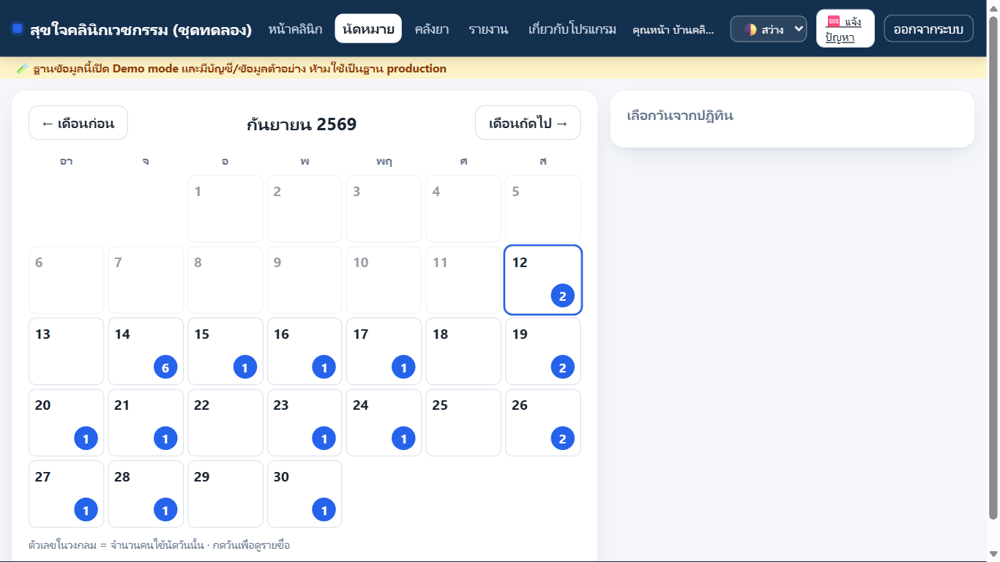

วงกลมบนวันที่คือจำนวนคนนัด กดวันที่เพื่อดูชื่อและหมายเหตุ กด **เลื่อนนัด** เพื่อเปลี่ยนวันโดยคงนัดเดิม หรือ **ยกเลิกนัด** เมื่อไม่ใช้แล้ว

วันที่มี 5-6 คนในชุดทดลองตั้งใจทำไว้ให้ลองตัดสินใจว่าแน่นเกินไปหรือไม่ ก่อนรับนัดเพิ่ม

## 11. คลังยา: “นิยามยา” ไม่เท่ากับ “รับของเข้า”

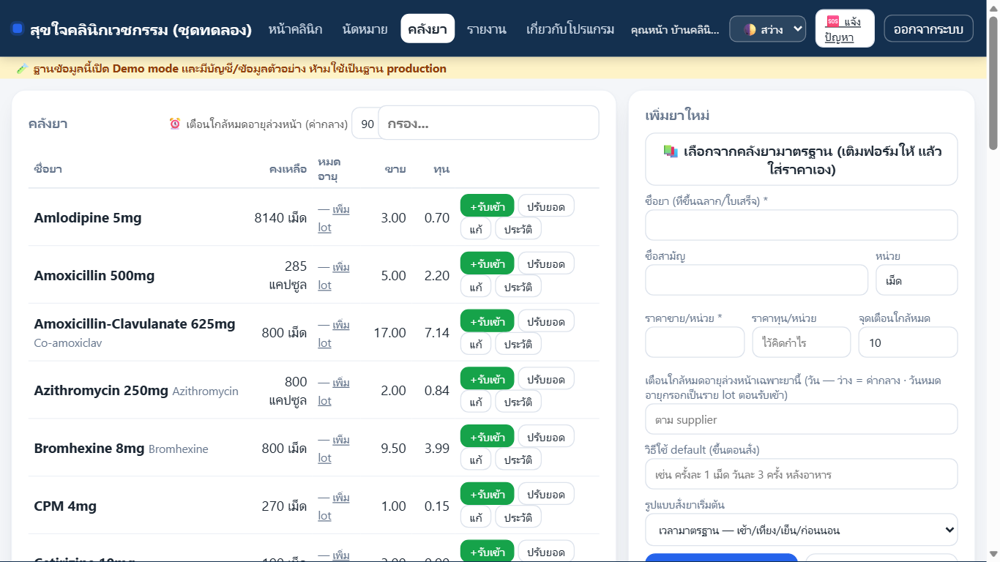

- เพิ่มยา = สร้างชื่อยา หน่วย ราคาขาย ทุน เกณฑ์ใกล้หมด และวิธีใช้เริ่มต้น สต็อกเริ่มที่ 0
- รับเข้า = ของจริงเข้าคลัง ใส่จำนวนและทุนของรอบนั้น
- ปรับยอด = หลังนับของจริง ใส่ยอดที่นับได้และเหตุผล
- ประวัติ = ดู ledger รับเข้า จ่ายยา ปรับยอด หรือคืนจาก void

เพิ่มยาได้สามทาง:

1. เลือกจาก **คลังยามาตรฐาน** แล้วตรวจชื่อสามัญ ขนาด วิธีใช้ หน่วย และราคาเอง
2. พิมพ์ยาใหม่เอง
3. นำเข้า CSV ระบบจะแจ้งจำนวนที่เพิ่มและบรรทัดที่มีปัญหา

ยาใกล้หมดจะแสดงป้ายเตือน ชุดทดลองมี 2-3 ตัวเหลือ 3 หน่วยเพื่อให้ลองรับเข้า หากยอดในระบบไม่ตรงของจริง ระบบไม่บล็อกการรักษา ให้จ่ายตามจริง แล้วนับและปรับยอดพร้อมเหตุผลเมื่อเหมาะสม

เมื่อเพิ่มยากลุ่มเสี่ยง ควรมีชื่อสามัญในชื่อหรือช่อง generic เช่น “Arcoxia (Etoricoxib)” เพื่อให้ตัวเตือนแพ้ยาจับได้ดีขึ้น

## 12. รายงานรายวันและสมุดรายเดือน

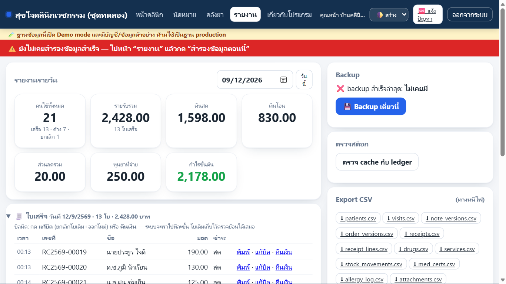

เลือกวันที่แล้วรายงานเปลี่ยนทันที แสดงคนไข้ เสร็จ/ค้าง/ยกเลิก รายรับ เงินสด เงินโอน ส่วนลด ทุนยา กำไรขั้นต้น และรายการใบเสร็จ

หากข้ามวันแล้วคิดว่าข้อมูลหาย ให้เลือกวันที่เมื่อวาน คิวหน้าคลินิกแสดงเฉพาะวันนี้ แต่ visit และบิลเก่ายังอยู่

สมุดรายเดือนรวมยอดสำหรับส่งนักบัญชีและดาวน์โหลด CSV ได้ ตัวเลขช่วยเตรียม ภ.ง.ด.94/90 แต่ต้องให้นักบัญชียืนยันการใช้จริง ระบบไม่เดา VAT หรือข้อสรุปภาษี

## 13. ตั้งค่าคลินิกและผู้ใช้

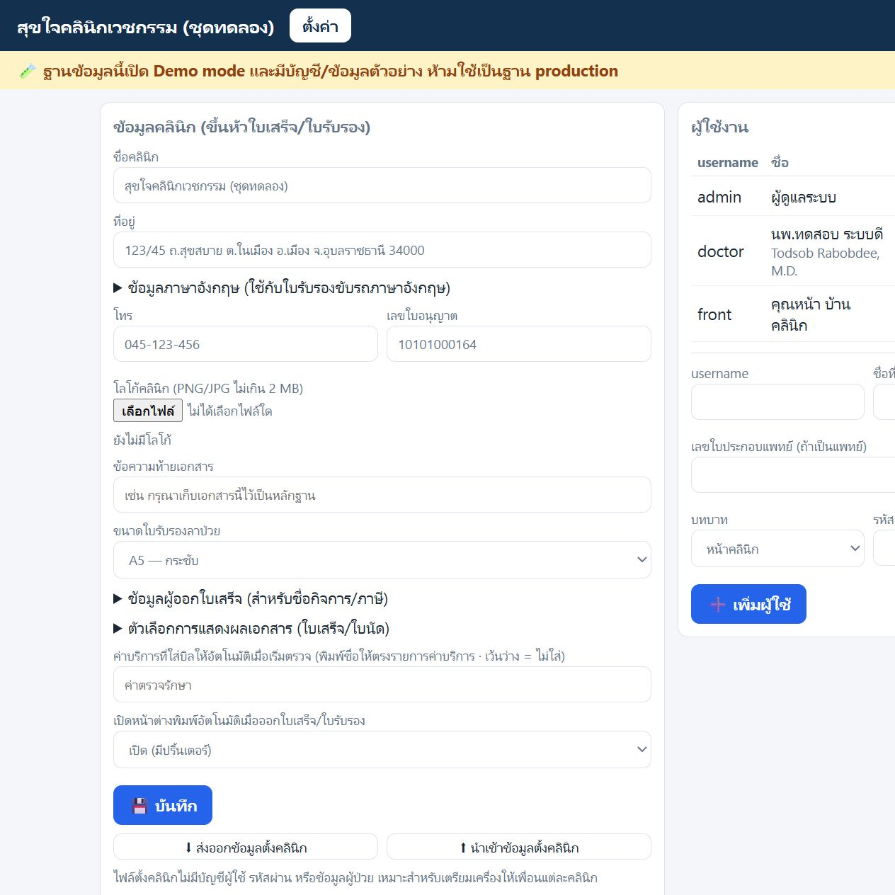

เข้าด้วยบัญชี admin แล้วทำตามลำดับ:

1. กรอกชื่อ ที่อยู่ โทร เลขใบอนุญาต ข้อมูลอังกฤษ และโลโก้ ตรวจสะกดให้ตรงเอกสารราชการ
2. ตั้งรูปแบบเอกสาร: ขนาดใบรับรอง ชื่อแพทย์/แคชเชียร์/เหตุผลนัด และการเปิดหน้าพิมพ์อัตโนมัติ
3. ตั้งชื่อค่าบริการที่ใส่อัตโนมัติเมื่อเริ่มตรวจ ให้ตรงกับชื่อในรายการบริการ
4. สร้างบัญชีแพทย์และหน้าร้านแยกคน ระบุเลขใบประกอบและชื่ออังกฤษของแพทย์
5. ให้เจ้าของบัญชีตั้งรหัสและ PIN ของตนเอง ไม่แชร์บัญชีร่วมกัน
6. ปิดบัญชีคนที่ออกจากงาน แทนการลบ เพื่อเก็บชื่อผู้ทำรายการย้อนหลัง

ส่งออก/นำเข้าข้อมูลตั้งคลินิกใช้ย้ายเฉพาะการตั้งค่า ไม่มีบัญชี รหัสผ่าน หรือข้อมูลคนไข้

## 14. สำรองข้อมูล: ทำครั้งเดียวให้ครบ แล้วตรวจทุกวัน

### 14.1 เตรียมคลาวด์

ติดตั้ง Google Drive for desktop แล้วลงชื่อด้วยบัญชีคลินิก หรือใช้ OneDrive ที่มีอยู่ ระบบคัดลอกไฟล์เข้ารหัสไปยังโฟลเดอร์นี้ แต่หลังตั้งค่าครั้งแรกควรเปิดเว็บไซต์คลาวด์ดูว่าไฟล์ซิงก์ขึ้นจริง

### 14.2 เลือกปลายทาง

1. เปิด Google Drive/OneDrive และเสียบ USB สำรองเฉพาะกรณีที่ต้องการใช้เพิ่ม
2. หน้า ตั้งค่า → สำรองและกู้ข้อมูล → **เลือกที่เก็บสำรอง / USB กู้เสริม**
3. เลือก Google Drive/OneDrive และ USB เพิ่มถ้ามี ตั้งเวลาสำรองให้ตรงช่วงที่เปิดเครื่อง หรือกดสำรองเองได้ทุกเมื่อ
4. บันทึกและกด **สำรองข้อมูลตอนนี้** ตรวจผลของแต่ละตำแหน่งว่าคัดลอกสำเร็จ หากใช้คลาวด์ ข้อความ **“ยังไม่ยืนยันการอัปโหลด”** หมายถึงโปรแกรมตรวจได้แค่ไฟล์ในโฟลเดอร์ ต้องเปิดเว็บไซต์ Google Drive/OneDrive ตรวจว่าไฟล์สำรองชุดล่าสุดอัปโหลดครบแล้ว ไม่ใช้สีเขียวเป็นหลักฐานว่าไฟล์ถึงคลาวด์

ระบบสำรองด้วยวิธีที่ปลอดภัยกับฐานข้อมูลที่กำลังเปิด ทุกไฟล์ที่ออกนอกเครื่องถูกเข้ารหัสและตรวจความถูกต้อง สำเนา **ในเครื่องหลัก** เก็บย้อนหลัง 30 วันและเก็บของวันที่ 1 รายเดือนไว้ถาวร ส่วน USB และคลาวด์ยังไม่ลบชุดเก่าอัตโนมัติ ให้ตรวจพื้นที่ว่างด้วย

### 14.3 ตั้งรหัสสำรองข้อมูล และ USB กู้เสริม

กด **ตั้ง / เปลี่ยนรหัสสำรองข้อมูล** พิมพ์รหัสสองครั้งและ PIN ผู้ดูแล แล้วกด **บันทึกรหัสและสำรองข้อมูล** ใช้รหัสยาว 12–128 ตัวอักษร จะเป็นคำที่จำได้หลายคำหรือภาษาไทยก็ได้ เลือกจำ จด หรือเก็บในโปรแกรมจัดการรหัสตามสะดวก ตรวจผลว่าส่งไฟล์สำหรับรหัสล่าสุดครบทุกปลายทางแล้ว และตรวจการอัปโหลดบนคลาวด์ด้วย

เครื่องใหม่ต้องมี **ข้อมูลสำรองครบโฟลเดอร์ + รหัสนี้** ไม่ต้องมี USB กู้ฉุกเฉิน หากลืมรหัสแต่เครื่องเดิมยังเปิดได้ ให้ตั้งใหม่แล้วสำรองอีกครั้ง หากลืมรหัสพร้อมกับเสียเครื่องเดิมและไม่มี USB กู้ฉุกเฉิน จะกู้ไม่ได้ ผู้พัฒนาไม่มีรหัสให้แทน การเปลี่ยนรหัสไม่ทำให้รหัสเก่าใช้ไม่ได้กับไฟล์ที่คนอื่นเคยคัดลอกไว้

หากต้องการ USB กู้ฉุกเฉินเพิ่ม ใช้ USB **อีกอันหนึ่ง** คนละอันกับข้อมูลสำรอง แล้วกดสร้าง Recovery Kit เก็บที่บ้านหรือตู้เซฟ ห้ามถ่ายรูป แชต หรือคัดลอกกุญแจเข้ารหัสเต็ม หากต้องตรวจว่าเป็นอันเดียวกัน ให้เทียบ fingerprint เท่านั้น ของเดิมยังใช้ได้

เหตุผลที่ต้องแยก: USB สำรองคือกล่องข้อมูล ส่วน Recovery Kit คือสิ่งที่ใช้เปิดกล่อง หากอยู่ด้วยกันแล้วหาย ความเสี่ยงสูงขึ้น

### 14.4 ซ้อมกู้

กด **ซ้อมกู้ข้อมูล** ใส่รหัสสำรอง แล้วกด **ลองกู้ด้วยรหัสนี้** ก่อนเปิดใช้จริง หลังเปลี่ยนรหัส และทุก 6 เดือน ระบบเปิดไฟล์จากปลายทางด้วยรหัสจริงโดยไม่ใช้กุญแจในเครื่องช่วย และไม่เปลี่ยนข้อมูลใช้งาน หากยังใช้ Recovery Kit แบบเดิมก็ซ้อมกู้จาก Kit ได้ การลองจากเครื่องเดิมยังไม่ยืนยันว่าอัปโหลดถึงคลาวด์แล้ว จึงควรลองกู้บนเครื่องใหม่ด้วย

## 15. เมื่อคอมพังหรือข้อมูลหาย

1. หยุดใช้เครื่องที่มีปัญหา อย่าติดตั้งซ้ำทับ
2. บนเครื่องใหม่ เข้าบัญชี Google Drive/OneDrive ของท่าน ดาวน์โหลดโฟลเดอร์สำรองให้ครบ หรือใช้ USB สำรอง
3. ติดตั้งโปรแกรมรุ่นที่รองรับรหัสสำรอง แล้วเปิดไอคอน **กู้ข้อมูลคลินิก** บนหน้าจอ เลือกโฟลเดอร์ที่ดาวน์โหลดไว้และใส่รหัสสำรอง
4. ตรวจเวลา **ข้อมูลที่แนะนำ** รายการหลังเวลานี้ไม่มีในสำเนา กดซ้อมกู้ก่อน แล้วพิมพ์เลขยืนยันและกด **ยืนยันกู้ข้อมูลจริง**
5. ตรวจจำนวนคนไข้ บัญชี สต็อก และรายการล่าสุด ตั้งปลายทางสำรองให้ตรงกับเครื่องใหม่ แล้วสำรองและซ้อมกู้อีกครั้งก่อนเปิดใช้งาน

หากใช้ USB กู้ฉุกเฉินเดิม ให้เปิดตัวช่วยจาก USB แทนได้ หากหน้าจอขาดการติดต่อหลังสั่งกู้ ให้เปิดตัวช่วยเดิมตรวจผลครั้งก่อนก่อนกู้ซ้ำ กรณีเครื่องเก่ากลับมา หยุดใช้งานเครื่องเก่า: ระบบจะหยุดส่งสำเนาเมื่อเห็นข้อมูลการย้ายเครื่องในปลายทางร่วมแล้ว แต่ตรวจไม่ได้ขณะคลาวด์ยังไม่ส่งข้อมูลถึงเครื่องเก่า

ตัวช่วยเก็บข้อมูลเดิมก่อนกู้ และหากกู้แล้วเปิดไม่ได้จะพยายามคืนของเดิม อย่างไรก็ตาม การกู้ข้อมูลจริงควรทำร่วมกับผู้ดูแล

## 16. เมื่อเกิดปัญหา

| อาการ | ทางแก้ภาษาคน |
|---|---|
| เปิดไม่ได้ | กดไอคอนเปิดอีกครั้ง ถ้ายังไม่ได้ใช้รีสตาร์ทระบบ แล้วค่อยรีสตาร์ท Windows |
| ตัวจริงกับทดลองสับสน | ดูชื่อไอคอนและแถบเหลือง ชุดทดลองต้องมีคำว่า “ทดลอง” เสมอ |
| SmartScreen สีฟ้า | More info → Run anyway เฉพาะไฟล์ที่ได้รับจากเจ้าของโครงการ |
| คิวเมื่อวานไม่อยู่ | เลือกวันที่เมื่อวานในรายงาน ข้อมูลไม่ได้หาย |
| รายงานรายวันเป็นศูนย์ | ตรวจวันที่ที่เลือกก่อน |
| เงินทอนไม่ขึ้น | ตรวจว่าเลือกเงินสดและใส่ยอดรับเงินแล้ว |
| เครื่องห้องตรวจเข้าไม่ได้ | ตรวจสาย LAN/Wi-Fi แล้วแจ้งผู้ดูแล เครื่องหน้าคลินิกยังใช้งานต่อได้ |
| นาฬิกา/วันที่ผิด | หยุดบันทึก ตั้งเวลา Windows แล้วรีสตาร์ทระบบ |
| ยาไม่ตรงของจริง | นับจริง → ปรับยอด → ใส่เหตุผล ห้ามแก้หรือลบ ledger เก่า |
| สำรองยังแดง | ตรวจว่า Drive/USB ต่ออยู่ กดสำรองตอนนี้ ถ้ายังไม่ผ่านแจ้งผู้ดูแลก่อนปิดวัน |

## 17. คำถามที่พบบ่อย

**ทำไมแก้ใบเสร็จเดิมตรง ๆ ไม่ได้?**  
เพราะใบเสร็จที่ออกแล้วเป็นเอกสารกฎหมาย การแก้เงียบ ๆ ทำให้ตรวจย้อนหลังไม่ได้ ระบบจึง void พร้อมเหตุผลและออกใหม่

**ทำไมต้องใส่เหตุผลตอนยกเลิก คืนเงิน หรือปรับสต็อก?**  
เพื่อให้คนปิดวัน นักบัญชี และเจ้าของคลินิกรู้ว่าเลขเปลี่ยนเพราะอะไร ไม่ต้องเดาภายหลัง

**ทำไม admin ไม่เห็นคิว?**  
Admin ใช้ตั้งค่าและดูแลความปลอดภัย งานประจำวันใช้ front หรือ doctor เพื่อให้ audit ระบุบทบาทถูกต้อง

**คัดลอกไฟล์ clinic.db ไป USB เองได้ไหม?**  
ไม่ได้ ฐานข้อมูลกำลังเปิดและมีไฟล์ประกอบ การคัดลอกตรงอาจไม่ครบและเป็นข้อมูลไม่เข้ารหัส ให้ใช้ปุ่มสำรองข้อมูลของระบบเท่านั้น

## E. Checklist ก่อนใช้ข้อมูลจริง — ห้ามข้าม

ใช้ชุดใช้งานจริงที่ตั้งค่าแล้ว คลินิกเก็บหลักฐานไว้กับตนเอง ไม่ส่งรายชื่อคนไข้หรือกุญแจให้ผู้พัฒนา ถ้าข้อใดไม่สำเร็จให้หยุดใช้ข้อมูลจริงจนแก้และซ้อมผ่าน ไม่ต้องรอผู้พัฒนามากดแทน

### E1. เตรียมที่เก็บสำรอง

- [ ] หากใช้ USB สำรองเพิ่ม ให้ติดป้าย “ข้อมูลสำรอง”; หากเลือกทำ Recovery Kit ให้ใช้อีกอันติดป้ายแยกกัน
- [ ] ลงชื่อ Google Drive/OneDrive ด้วยบัญชีคลินิก เปิดโฟลเดอร์ที่ซิงก์ได้จริง
- [ ] หน้า “ตั้งค่า” เลือกปลายทางคลาวด์ และ USB เพิ่มถ้ามี ตั้งเวลาสำรองช่วงที่เปิดเครื่อง แล้วบันทึก

### E2. สำรองครั้งแรกและตรวจไฟล์ปลายทาง

- [ ] กด “สำรองข้อมูลตอนนี้” รอจนเห็นผลสำเร็จ
- [ ] เปิด USB/โฟลเดอร์คลาวด์ เห็นไฟล์รอบใหม่ชนิด .enc ไม่มี .db เปลือย ห้ามคัดลอกฐานข้อมูลตรง ๆ
- [ ] เปิดเว็บไซต์ Google Drive/OneDrive ด้วยบัญชีคลินิกเอง ตรวจว่าไฟล์รอบใหม่ขึ้นถึงคลาวด์แล้ว ไม่ใช่แค่อยู่ในโฟลเดอร์เครื่องหลัก

### E3. เตรียมวิธีกู้ที่เลือกใช้

เลือกทำข้อรหัสสำรองหรือข้อ Recovery Kit อย่างน้อยหนึ่งทาง แล้วเก็บรหัสหรือกุญแจด้วยตนเอง

- [ ] **ใช้รหัสสำรอง:** ตั้งรหัสและเลือกวิธีเก็บที่ตนเองหาเจอ ตรวจว่าส่งไฟล์สำหรับรหัสล่าสุดครบปลายทางแล้ว และตรวจว่าอัปโหลดถึงคลาวด์ด้วย
- [ ] **หรือใช้ Recovery Kit:** สร้างลง USB คนละอันกับข้อมูลสำรอง รอผลสำเร็จและตรวจว่าเปิดตัวช่วยจาก USB ได้ หากใช้รหัสสำรองแล้ว ข้อนี้เป็นทางเสริม ข้ามได้
- [ ] เก็บรหัสหรือกุญแจไว้เอง ห้ามถ่าย ส่งข้อความ หรือแนบไฟล์กุญแจใน issue; ผู้พัฒนาไม่ต้องรู้รหัสจริง

### E4. ซ้อมกู้ในโปรแกรม

- [ ] ให้ข้อมูลสำรองเข้าถึงได้ กด “ซ้อมกู้ข้อมูล” และใส่รหัสสำรอง; หากเลือกใช้ Kit ให้เปิดตัวช่วยจาก USB แล้วซ้อมกู้รอบล่าสุด
- [ ] เห็นผลว่าสำเนาเปิดและตรวจได้ โดยข้อมูลใช้งานไม่เปลี่ยน
- [ ] ถ้าขึ้นผิดพลาด หยุด เก็บเฉพาะข้อความที่ไม่มีข้อมูลลับ ห้ามเปลี่ยนไปกดกู้จริงเพื่อทดลอง

### E5. ซ้อมกู้ครบเส้นบนเครื่องที่สอง

- [ ] ใช้เครื่องทดสอบที่ไม่มีข้อมูลคลินิกใช้งานอยู่ ติดตั้งโปรแกรมรุ่นที่รองรับรหัสสำรอง ห้ามใช้เครื่องหลักหรือกู้ทับเครื่องที่กำลังทำงาน
- [ ] ดาวน์โหลดโฟลเดอร์สำรองครบชุดจากเว็บไซต์คลาวด์มาเป็นสำเนาสำหรับซ้อม อย่าเชื่อมปลายทางสำรองร่วมกับเครื่องหลักขณะทดลองกู้
- [ ] เปิด “กู้ข้อมูลคลินิก” เลือกโฟลเดอร์สำเนา ใส่รหัสและซ้อมกู้ก่อนยืนยันกู้จริง; หากเลือกใช้ Kit ให้เปิดตัวช่วยจาก USB แทน
- [ ] เปิดสำเนาที่กู้ ตรวจจำนวนคนไข้และวันที่รายการล่าสุดกับเครื่องหลัก โดยไม่ส่งรายละเอียดคนไข้ใน issue
- [ ] ปิดระบบซ้อม ตรวจชื่อเครื่องและตำแหน่งให้แน่ใจก่อนล้างเฉพาะสำเนาซ้อม ไม่ทิ้งข้อมูลจริงไว้ในเครื่องอื่น
- [ ] หากมี Recovery Kit ให้เก็บแยกจากคอมพิวเตอร์และ USB สำรอง เช่น ตู้เซฟ

### E6. ทดลองทำงานสองเครื่องและปิดรอบติดตั้ง

- [ ] ใช้ชุดทดลอง: หน้าร้านลงทะเบียนคนสมมติ ห้องตรวจเห็นคิว แพทย์ตรวจและสั่งยา หน้าร้านเห็นผลและพิมพ์เอกสารได้
- [ ] ใช้บัญชีของแต่ละบทบาท ไม่แชร์รหัส เปลี่ยนรหัสเริ่มต้นทุกบัญชีก่อนใช้ข้อมูลจริง
- [ ] รีสตาร์ท Windows แล้วเปิดจากไอคอนทั้งสองเครื่องได้ตามปกติ
- [ ] ผู้ใช้หน้าร้านและแพทย์ทำภารกิจของตนเองบนเครื่องจริงโดยไม่มีคนบอกปุ่ม จดจุดที่ต้องเดา/ทำไม่ได้และวิธีแก้ขัด
- [ ] เก็บแบบทดลองและข้อมูลเครื่อง/การขยายจอไว้ในคลินิก เริ่มคู่ขนานกับแผนสำรองก่อนตัดสินใจใช้จริง

## อัปเดตโปรแกรมและดูรุ่น

เข้าบัญชีผู้ดูแลที่เครื่องหน้าร้าน → “ตั้งค่า” → “อัปเดตโปรแกรม” → “ตรวจหารุ่นใหม่” อ่านผลก่อนกด “อัปเดตตอนนี้” ต้องมีอินเทอร์เน็ตตอนดาวน์โหลด การทำงานประจำวันยังไม่ต้องมีอินเทอร์เน็ต

เมื่อโปรแกรมเปิดกลับ อาจให้เข้าระบบใหม่ แล้วต้องเห็นแถบผลอัปเดตและรุ่นที่ใช้ หากยังขึ้นกำลังทำงานหรือติดต่อไม่ได้ ห้ามติดตั้ง ZIP ทับฐานข้อมูล ให้เก็บข้อความและเปิด issue โดยไม่ส่งข้อมูลจริง

ทุกบัญชีดูชื่อรุ่นได้: หน้าร้าน/แพทย์กด “เกี่ยวกับโปรแกรม”; ผู้ดูแลดูการ์ดชื่อนี้ในหน้าตั้งค่า การบริจาคเป็นทางเลือก ไม่มีปุ่มบังคับและไม่เปิดสิทธิ์ผู้ดูแลให้บัญชีอื่น

## ช่วยตัวเองเมื่อการติดตั้งสะดุด

| สิ่งที่เห็น | ทำอย่างไร |
|---|---|
| “ไม่พบไฟล์โปรแกรมข้าง ๆ ตัวติดตั้ง” | ปิดหน้าต่าง ZIP คลิกขวา ZIP → Extract All แล้วเปิดตัวติดตั้งในโฟลเดอร์ที่แตกครบ ห้ามลากออกมาเฉพาะ .cmd |
| “Windows protected your PC” | ตรวจว่าโหลด ClinicSetup/ClinicTrial จาก mk-artifacts ทางการเท่านั้น แล้ว More info → Run anyway ถ้าไม่แน่ใจให้หยุด ไม่ปิด Defender |
| Windows ถามอนุญาตให้เปลี่ยนแปลงเครื่อง | ตรวจว่ากำลังเปิดตัวช่วยติดตั้งของโครงการ ถ้าเป็นบัญชีมาตรฐานให้ผู้ดูแล Windows ของคลินิกกรอกรหัสเอง ไม่ส่งรหัสใน issue |
| “พบระบบคลินิกพร้อมฐานข้อมูลอยู่แล้ว” | ห้ามลบฐานข้อมูล ใช้เมนูอัปเดตจากระบบเดิม ถ้าติดตั้งครั้งแรกจริงให้ตรวจว่าเปิดชุดทดลอง/ตัวจริงสลับกันหรือไม่ |
| เปิดระบบไม่ได้/พอร์ตถูกใช้งาน | ลองเปิดไอคอนเดิมเพียงครั้งเดียว ตรวจว่าไม่มีระบบคลินิกซ้ำ หากมีโปรแกรมอื่นใช้ช่องทาง 8080 ให้ปิดเฉพาะโปรแกรมที่รู้จัก ห้ามฆ่า process ที่ไม่รู้จักหรือเปลี่ยนพอร์ตสุ่ม เปิด issue พร้อมข้อความที่เห็นหากยังไม่ได้ |
| Windows Firewall ถามให้อนุญาต | อนุญาตเฉพาะเครือข่ายส่วนตัวของคลินิก ห้ามเปิดให้เครือข่ายสาธารณะ หากไม่ขึ้นคำถาม ใช้ปุ่ม “ตั้งค่าเครื่องห้องตรวจ” ให้ตัวช่วยตรวจช่องทาง ไม่ต้องปิด Firewall ทั้งเครื่อง |
| เครื่องห้องตรวจเตือนใบรับรอง | อย่าข้ามคำเตือน ตรวจว่ามาจากโฟลเดอร์ “ส่งไปเครื่องหมอ” ชุดล่าสุดของคลินิก แล้วรัน “ติดตั้งใบรับรอง (เครื่องห้องตรวจ)” ด้วยผู้ใช้ Windows คนที่จะใช้งานจนเห็นผลสำเร็จ |
| รันตัวช่วยใบรับรองแล้วไม่สำเร็จ | ตรวจว่ามี clinic.cer อยู่ข้างตัวช่วยและคัดลอกโฟลเดอร์ครบ ถ้าเครื่องหลักเปลี่ยนเครือข่าย ให้ตั้งค่าสองเครื่องใหม่แล้วคัดลอกชุดล่าสุดมา ห้ามนำ clinic.pfx หรือไฟล์รหัสผ่านมาเครื่องห้องตรวจ |
| เครื่องห้องตรวจหมุนค้าง | ตรวจเครื่องหลักเปิดอยู่และเข้าระบบที่เครื่องหลักได้ก่อน จากนั้นตรวจ Wi-Fi/LAN เดียวกัน ไม่ใช้ Guest Wi-Fi แล้วดูสถานะการ์ดเครื่องห้องตรวจ |

ภาพ Windows จริงที่ยังรอเติมเพื่อยืนยันคู่มือติดตั้งแบบไม่ต้องถามใคร: UAC, ยืนยันเครือข่ายส่วนตัว, ผลตั้งค่าสองเครื่อง, SmartScreen และยืนยันใบรับรอง ส่วนภาพผลติดตั้งใบรับรองมีแล้วในขั้น 3 ภาพแผนผัง SVG เป็นเพียงภาพอธิบาย ไม่ใช่ภาพ Windows จริง รุ่นคู่มือนี้จึงยังต้องทดลองติดตั้งโดยผู้ใช้ใหม่บนเครื่องจริงก่อนเผยแพร่

**ลบชุดทดลองอย่างไร?**  
ปิดชุดทดลองก่อน แล้วให้ผู้ดูแลลบ `C:\clinic-trial` และไอคอนทดลอง ข้อมูลจริงใน `C:\clinic` เป็นคนละโฟลเดอร์ ห้ามเลือกผิด

## ฉลากยาติดซอง (รุ่นพัฒนา 1.0.7 — เปิดใช้เอง)

ผู้ดูแลเปิดในเอกสารและการพิมพ์ หน้าร้านเปิดจากใบเสร็จ เลือกยาและช่องเริ่มต้นได้ ข้อความล้นจะหยุดพิมพ์ ไม่ย่อหรือตัดวิธีใช้ หมอเปิดดูและให้หน้าร้านพิมพ์ รายละเอียดใน [คู่มือฉลากยาติดซอง](ฉลากยาติดซอง.md) ม้วนฉลากยังเป็นการทดลองกับเครื่องจริง

## เมื่อมีหมอหลายคน (รุ่นพัฒนา 1.0.7)

คิวกำลังตรวจจะแสดงชื่อหมอ และหมอคนอื่นไม่มีปุ่มเปิดต่อ คิวรอยังเป็นคิวรวม ระบุ “มาหาหมอ” เฉพาะคนไข้ที่บอกเอง นัดวันนี้ที่ระบุหมอจะเติมให้อัตโนมัติ นัดครั้งหน้าเลือกหมอได้ เช่น หมอ B ตรวจแทนแล้วนัดกลับหา A ก่อนแทนนัดของหมออื่นจะมีชื่อและวันที่ให้ยืนยัน ถ้ามีหมอเปิดใช้งานเพียงคนเดียว ตัวเลือกและป้ายเหล่านี้จะซ่อน

## อัปเดตส่วนประกอบสำหรับเครื่องที่ลงรุ่นก่อน 1.0.7

เครื่องที่ติดตั้งใหม่จากชุด 1.0.7 มีส่วนประกอบครบแล้ว ไม่ต้องโหลด Git หรือ Node.js เพิ่ม ส่วนเครื่องเดิมให้อัปเดตผ่านโปรแกรมก่อน แล้วเปิด ผู้ดูแล → ระบบ / อัปเดตโปรแกรม ถ้าเห็น “มีส่วนประกอบโปรแกรมที่ต้องอัปเดต” ให้ทุกเครื่องหยุดใช้งานชั่วครู่ แล้วกด **อัปเดตส่วนประกอบ** จากเครื่องหน้าร้าน

อ่านกล่องยืนยันและอนุญาตเมื่อพร้อม ระบบสร้างและตรวจสำเนาฐานข้อมูลก่อนเปลี่ยน เมื่อสำเร็จให้เปิดโปรแกรมจากไอคอนเดิม กด **ตรวจสถานะอีกครั้ง** และลองเข้าเครื่องห้องตรวจ หากยกเลิกจะยังไม่เปลี่ยนส่วนประกอบ หากไม่สำเร็จให้ดูสถานะและแจ้งผู้ดูแล ไม่ต้องลบโปรแกรมหรือลงทับข้อมูล

## เมื่อเปลี่ยนบัญชีผู้ใช้งาน

เปลี่ยนรหัสผ่าน เปลี่ยน PIN หรือปิดบัญชีแล้ว เครื่องที่เข้าสู่บัญชีนั้นค้างอยู่ต้องเข้าสู่ระบบใหม่ หากผู้ดูแลเปลี่ยนรหัสของตัวเอง ระบบพาไปหน้าเข้าสู่ระบบพร้อมข้อความยืนยัน ใช้รหัสใหม่เข้าสู่ระบบ หากขาดการติดต่อหลังบันทึก ให้ลองรหัสใหม่ก่อนเปลี่ยนซ้ำ ข้อมูลช่องอื่นจะไม่ถูกเปลี่ยนเมื่อรายการที่ส่งมาไม่ถูกต้อง
