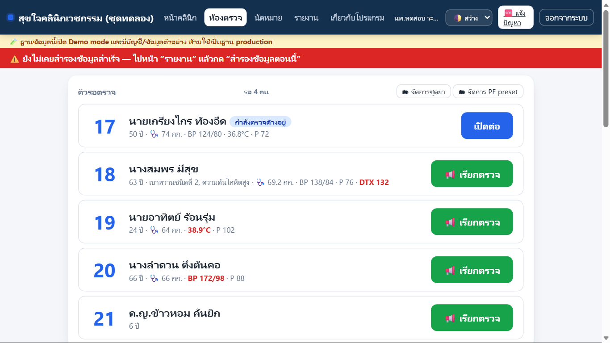
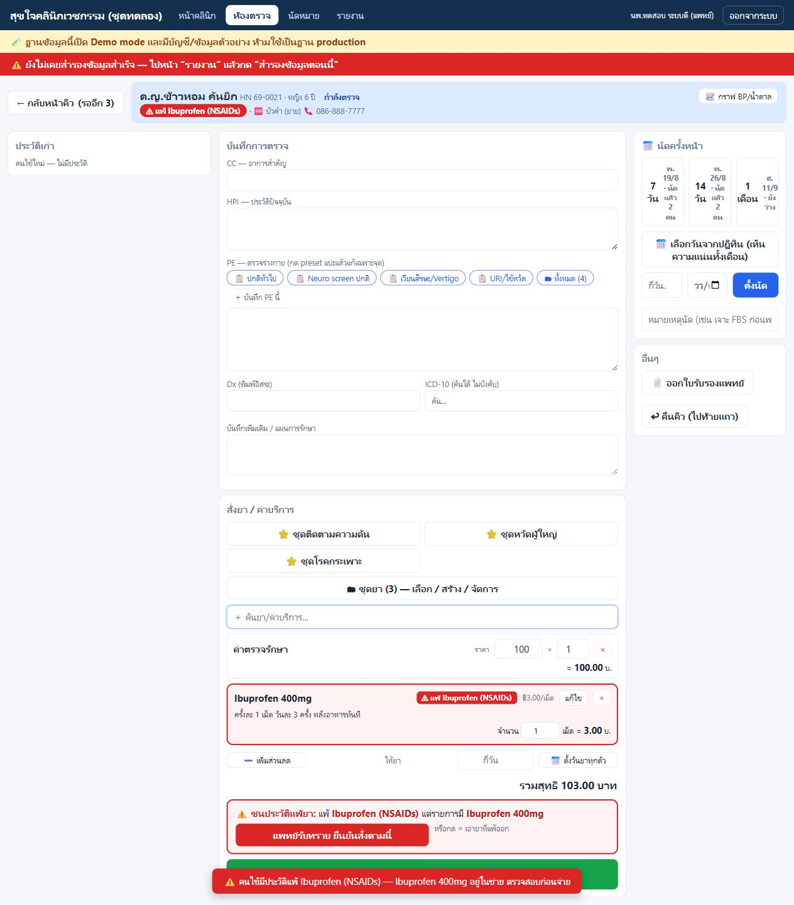
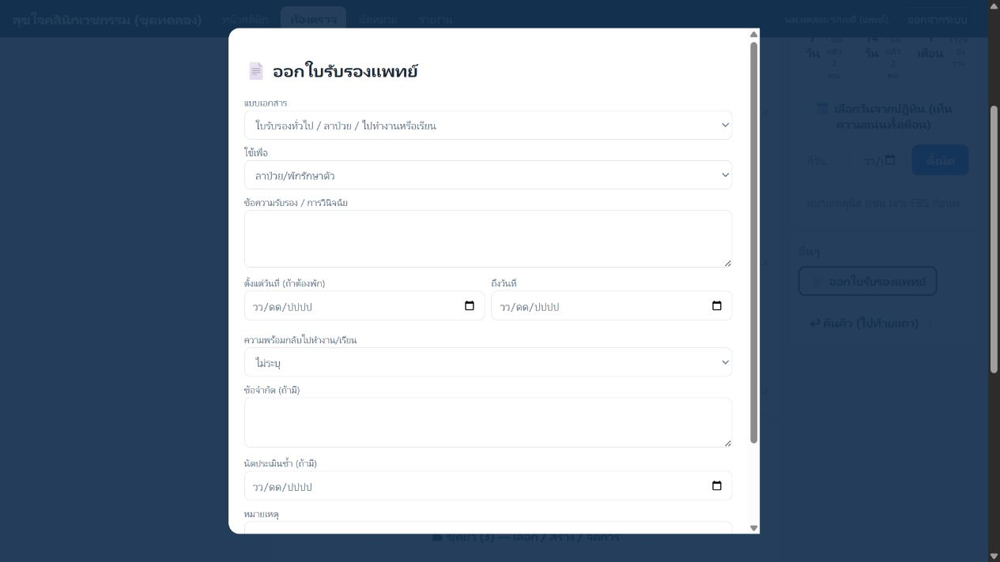

# คู่มือระบบคลินิกสำหรับแพทย์

ฉบับทำตามได้เลย · สำหรับ **ชุดทดลอง** และ **ระบบที่ใช้จริง**  
ฉบับเตรียมสำหรับ 1.0.7 · 14 กันยายน 2569 · ยังไม่เผยแพร่

> คู่มือนี้เขียนสำหรับแพทย์ที่ไม่จำเป็นต้องรู้เรื่องคอมพิวเตอร์ ถ้าคำใดอ่านแล้วไม่รู้ว่าต้องกดอะไรต่อ ให้ถือว่าเป็นจุดที่คู่มือหรือระบบต้องปรับ ไม่ใช่ความผิดของผู้ใช้

[[toc]]

หลังแตก ZIP รุ่น 1.0.7 จะเห็นเพียง 3 รายการ: **ติดตั้งระบบคลินิก.cmd**, **อ่านก่อนติดตั้ง.txt** และ **ชุดโปรแกรม (ไม่ต้องเปิด)** ดับเบิลคลิกไฟล์ติดตั้งเพียงไฟล์เดียว ไม่ต้องเปิดโฟลเดอร์ชุดโปรแกรม ถ้าติดตั้งอยู่แล้วให้อัปเดตจากในโปรแกรม

## 1. ก่อนเริ่ม: สองชุดที่ได้รับต่างกันอย่างไร

| ชุด | ใช้ทำอะไร | ข้อมูลข้างใน | เปิดจากไอคอน |
|---|---|---|---|
| **ระบบคลินิก (ทดลอง)** | ฝึกมือและลองกดทุกปุ่ม | คนไข้สมมติประมาณ 100 คน ประวัติยา บิล นัด และคลังยาสมมติ | `ระบบคลินิก (ทดลอง)` |
| **ระบบคลินิก** | ใช้กับคลินิกจริงหลังทดลองและตั้งค่าครบ | เริ่มต้นว่าง ไม่มีคนไข้ตัวอย่าง | `ระบบคลินิก` |

ฝึกจาก **ระบบคลินิก (ทดลอง)** ก่อน เมื่อพร้อมใช้จริง ตัวติดตั้งชุดจริงจะถามยืนยัน **ลบชุดทดลองและข้อมูลฝึกทั้งหมด** แล้วเริ่มฐานจริงว่าง ข้อมูลฝึกจะไม่ย้ายตามมา หากเคยกรอกข้อมูลที่ต้องเก็บหรือข้อมูลคนไข้จริงในชุดทดลอง ให้กด **ไม่ใช่** แล้วติดต่อผู้ดูแลก่อน

หลังติดตั้งจริง ปิดแท็บทดลองเดิมและใช้ไอคอน **ระบบคลินิก** ถ้าเป็นเครื่องห้องตรวจ ให้รับชุดเชื่อมต่อของตัวจริงจากหน้าร้านใหม่ ใช้โฟลเดอร์ **ส่งไปเครื่องหมอ** และทางลัด **เปิดระบบคลินิก (ห้องหมอ)** แทนชุดทดลองที่มีคำว่า **ทดลอง** ต่อท้าย

จุดสังเกตที่สำคัญที่สุด: ชุดทดลองมี **แถบสีเหลือง** เขียนว่ามีข้อมูลตัวอย่างและห้ามใช้เป็นฐานจริง หากไม่เห็นแถบนี้ ให้หยุดก่อนกรอกข้อมูลสมมติ เพราะอาจเปิดผิดชุด

> ชุดทดลองเล่นพังได้ ลองผิดได้ และลบทิ้งเพื่อติดตั้งใหม่ได้ แต่ห้ามกรอกชื่อหรือข้อมูลคนไข้จริงลงในชุดทดลอง

### ถ้าทดลองพร้อมหน้าร้านด้วยคอมพิวเตอร์สองเครื่อง — ทำ 4 ขั้นตามลำดับ

ติดตั้ง Clinic Trial ที่เครื่องหน้าร้านเพียงเครื่องเดียว — เครื่องหมอ**ไม่ต้องติดตั้งโปรแกรม**และไม่ต้องคัดลอกฐานข้อมูล ทำทีหลังได้ทุกเมื่อ:

1. **(หน้าร้าน)** ผู้ดูแลเข้าหน้าตั้งค่า → การ์ด **เครื่องห้องตรวจ** → กด **ตั้งค่าเครื่องห้องตรวจ** แล้วกด Yes ตามกล่องจนขึ้น “สำเร็จ” (โปรแกรมจะรีสตาร์ทและให้เข้าระบบใหม่ — ปกติ)
2. **(หน้าร้าน)** ส่งโฟลเดอร์ **ส่งไปเครื่องหมอ** (บน Desktop เครื่องหน้าร้าน) มาให้ — ในโฟลเดอร์ไม่มีข้อมูลคนไข้
3. **(เครื่องหมอ — ครั้งเดียว)** ดับเบิลคลิก **ติดตั้งใบรับรอง (เครื่องห้องตรวจ)** → ถ้ามีกล่องสีฟ้าให้กด **More info → Run anyway** → กด **Yes** เมื่อ Windows ถาม → รอจนขึ้นกล่อง “ติดตั้งใบรับรองแล้ว”
4. **(เครื่องหมอ)** ดับเบิลคลิก **เปิดระบบคลินิก (ห้องหมอ)** → ที่อยู่ขึ้นต้นด้วย `https` มีรูปกุญแจ ไม่มีคำเตือน → เข้า `doctor` / `doctor123`

ทั้งสองเครื่องต้องอยู่ Wi-Fi/สาย LAN วงเดียวกัน และเครื่องหน้าร้านต้องเปิดอยู่ · หากเบราว์เซอร์เตือนว่า “ไม่ปลอดภัย” แปลว่ายังไม่ได้ทำข้อ 3 หรือเครื่องหน้าร้านเพิ่งเปลี่ยนเลขที่อยู่ (เปลี่ยน Wi-Fi/เราเตอร์) — ให้หน้าร้านดูการ์ดในหน้าตั้งค่า กด **ตั้งค่าเครื่องห้องตรวจใหม่** แล้วส่งโฟลเดอร์ใหม่มาทำข้อ 3 ซ้ำ · หากเปิดไม่ได้เลยให้ดูว่าเผลอใช้ Guest Wi-Fi หรือไม่ · ปุ่มตั้งค่ากดได้จากเครื่องหน้าร้านเท่านั้น ที่เครื่องหมอจะเห็นสถานะแต่ปุ่มเป็นสีจางพร้อมบอกเหตุผล วิธีนี้ใช้กับข้อมูลสมมติเท่านั้น

## 2. ระบบทำอะไรให้ และอะไรที่แพทย์ต้องตัดสินใจเอง

ระบบช่วยจัดคิว เก็บประวัติ แสดงกราฟ คำนวณจำนวนยา คิดเงิน สร้างเอกสาร เก็บรุ่นเดิม และเตือนเรื่องแพ้ยา/ข้อมูลสำรอง ระบบบันทึกทันทีเมื่อกดบันทึกหรือจบขั้นตอน

ระบบจะไม่วินิจฉัย ไม่เลือกยา ไม่รับรองขนาดยา และไม่ตัดสินใจแทนแพทย์ การค้น ICD-10 เป็นตัวช่วยค้น ไม่บังคับใช้ คลังยามาตรฐานเป็นรายการให้เลือกดัด ไม่ใช่คำแนะนำการรักษา

เอกสารที่ออกแล้ว เช่น ใบเสร็จและใบรับรองแพทย์ จะไม่ถูกแก้เงียบ ๆ หากผิดต้อง **ยกเลิกพร้อมเหตุผลแล้วออกใหม่** เพื่อให้ตรวจสอบย้อนหลังได้

## 3. เข้าใช้ครั้งแรกและสิทธิ์ของแต่ละบัญชี

ในชุดทดลองใช้บัญชีต่อไปนี้:

- แพทย์: `doctor` / `doctor123`
- หน้าร้าน: `front` / `front123`
- ผู้ดูแล: `admin` / `admin1234`

ในระบบจริงให้ใช้บัญชีและรหัสที่ตั้งในวันติดตั้ง ห้ามใช้รหัสของชุดทดลองกับข้อมูลจริง

| หน้าจอ/งาน | แพทย์ | หน้าร้าน | ผู้ดูแล |
|---|:---:|:---:|:---:|
| ดูคิวและเรียกตรวจ | ✓ | ดูสถานะคิว | - |
| บันทึกการตรวจ สั่งยา นัด ออกใบรับรอง | ✓ | - | - |
| ลงทะเบียน วัดสัญญาณชีพ คิดเงิน | - | ✓ | - |
| เพิ่มยา รับยาเข้า ปรับยอด | - | ✓ | - |
| ดูปฏิทินและรายงาน | ✓ | ✓ | - |
| ตั้งคลินิก ผู้ใช้ สำรองและกู้ข้อมูล | - | - | ✓ |

หากเข้าเป็นแพทย์แล้วไม่เห็นปุ่มเพิ่มยาเข้าคลัง นั่นเป็นสิทธิ์ที่ตั้งใจไว้ ไม่ใช่ระบบเสีย ให้บัญชีหน้าร้านเพิ่มนิยามยาและรับของเข้าคลัง

## 4. อ่านหน้าคิวให้ทันในไม่กี่วินาที

1. เปิดไอคอนระบบ แล้วเข้าด้วยบัญชีแพทย์
2. ดูจำนวน “รอ ... คน” ด้านบน
3. ตัวเลขอุณหภูมิ ความดัน ชีพจร หรือน้ำตาลที่เกินเกณฑ์จะเป็นสีแดง เพื่อช่วยกวาดตาหาคนที่ควรประเมินก่อน
4. ถ้าการ์ดเขียนว่า **กำลังตรวจค้างอยู่** ให้กด **เปิดต่อ** งานร่างเดิมยังอยู่
5. คนที่รอตรวจให้กด **เรียกตรวจ** ระบบจะเปลี่ยนสถานะและแจ้งหน้าร้านว่าแพทย์เรียกคิวใด

จุดที่คนมักพลาด: การเรียกตรวจไม่ใช่การลบคนอื่นออกจากคิว หากเรียกผิดหรือคนไข้ยังไม่พร้อม กด **คืนคิว (ไปท้ายแถว)** ได้

## 5. ห้องตรวจ: ทำตามลำดับซ้ายไปขวา

### 5.1 ทวนตัวคนไข้และข้อมูลเสี่ยง

ก่อนพิมพ์ ให้ทวนชื่อ HN อายุ โรคประจำตัว สัญญาณชีพ และแถบแพ้ยาด้านบน หากมีผู้ติดต่อฉุกเฉินจะเห็นใกล้ข้อมูลคนไข้

### 5.2 อ่านประวัติและกราฟ

- ประวัติเก่าเรียงจากใหม่ไปเก่า เปิดดู note รายการยา ใบเสร็จและเอกสารที่เกี่ยวข้องได้
- ปุ่ม **กราฟ BP/น้ำตาล** แสดงแนวโน้มจากการมาหลายครั้ง เหมาะกับ HT/DM
- ใน **ประวัติเก่า** เปิดครั้งที่ต้องการแล้วกด **เพิ่มยาจากครั้งนี้** ระบบจะเพิ่มเฉพาะยาของวันนั้นต่อท้ายรายการปัจจุบัน ไม่ดึงค่าบริการเก่า ไม่เพิ่มยาที่มีอยู่แล้วซ้ำ และไม่ทับจำนวนหรือวิธีใช้ที่หมอแก้ไว้

### 5.3 บันทึก CC, HPI, PE, Dx และแผน

ช่องบันทึกร่างอัตโนมัติระหว่างพิมพ์ หากเผลอกลับหน้าคิวแล้วเปิดต่อ ข้อความจะยังอยู่

- **CC**: อาการสำคัญ ช่องนี้อาจมีข้อความที่หน้าร้านรับไว้แล้ว
- **HPI**: ประวัติปัจจุบัน
- **PE**: กด preset เพื่อแปะข้อความตรวจปกติแล้วแก้เฉพาะจุด ลดการพิมพ์ซ้ำ
- **Dx**: พิมพ์อิสระ
- **ICD-10**: ค้นคำไทยหรือรหัสได้ ไม่บังคับ
- **บันทึกเพิ่มเติม/แผน**: คำแนะนำ การติดตาม สัญญาณอันตราย

ปุ่ม **จัดการ PE preset** ใช้สร้าง ปักดาว หรือปิดข้อความที่ใช้ประจำ การปักดาวจำแยกตามเครื่อง

## 6. สั่งยาและค่าบริการ

### 6.1 สามทางที่เร็วที่สุด

1. กด **ชุดยา ⭐** ที่ปักไว้ เหมาะกับรายการที่ใช้ซ้ำ
2. กด **ชุดยา (...) — เลือก/สร้าง/จัดการ** เพื่อดูทั้งหมด สร้างชุดจากร่างปัจจุบัน หรือปิดชุดเก่า
3. พิมพ์ชื่อยาในช่อง **ค้นยา/ค่าบริการ** แล้วเลือกรายการ

ค่าตรวจรักษาอาจถูกใส่อัตโนมัติตามที่ผู้ดูแลตั้งไว้ หากไม่ต้องการในเคสนั้นกด × ออกได้ ราคาที่แก้ในเคสนี้เป็นราคาของบิลเคสนี้ ไม่ได้เปลี่ยนราคากลางในคลัง

### 6.2 จำนวนและ dose grid

- ช่องจำนวนบนแถวยาพิมพ์จำนวนจ่ายจริงได้ทันที
- กด **แก้ไข** เพื่อเปิด dose grid: จำนวนต่อครั้ง ช่วงเวลา ก่อน/หลังอาหาร และจำนวนวัน ระบบจะคำนวณจำนวนรวม
- ช่อง **ให้ยา ... วัน** แล้วกด **ตั้งวันยาทุกตัว** ใช้กับยาที่มีตารางรับประทานมาตรฐาน
- ยา PRN หรือยาที่กำหนดจำนวนเองจะไม่ถูกฝืนคำนวณตามวัน ให้แพทย์ใส่จำนวนจริง
- ทุกครั้งที่ใช้ “เพิ่มยาจากครั้งนี้” หรือชุดยา ให้ดูวันที่และวินิจฉัยของประวัติที่เลือก แล้วทวนว่าอาการและผู้ป่วยครั้งนี้เหมาะกับรายการเดิมหรือไม่

### 6.3 ส่วนลด

แพทย์เพิ่มส่วนลดในร่างได้ ระบบจะส่งเหตุผลและยอดไปหน้าร้าน เหตุผลควรอ่านรู้เรื่อง เช่น “ผู้สูงอายุ” หรือ “ติดตามหลังทำแผล” หลีกเลี่ยงคำกว้าง ๆ เช่น “ลดให้”

## 7. การเตือนแพ้ยา: ทำไมกดข้ามเฉย ๆ ไม่ได้

ระบบเตือนสามชั้น: ตอนเลือกยา, ป้ายแดงบนแถวยา และกรอบยืนยันก่อนจบตรวจ ระบบเทียบทั้งชื่อยาที่เลือกกับกลุ่มเสี่ยงที่รู้จัก เช่น penicillin, NSAIDs และ sulfa

เมื่อพบการชน:

1. ทวนประวัติแพ้ยาและปฏิกิริยาที่เคยเกิด
2. ถ้าเลือกผิด กด × เอายาออก
3. ถ้าแพทย์ประเมินแล้วจำเป็นต้องสั่งจริง ให้กด **แพทย์รับทราบ ยืนยันสั่งตามนี้** แล้วจึงจบตรวจ
4. ถ้าแก้รายการยาหลังยืนยัน ระบบจะให้ยืนยันใหม่ เพราะการยืนยันผูกกับรายการชุดนั้น

ระบบไม่ hard-block การตัดสินใจของแพทย์ แต่ไม่ยอมให้รายการเสี่ยงผ่านแบบเงียบ ๆ หากรู้ว่าเป็นยากลุ่มเดียวกันแต่ระบบไม่เตือน ให้หยุดก่อนจบตรวจและแจ้งผู้ดูแลเพื่อเพิ่มชื่อสามัญ/ตรวจรายการยา

## 8. ทวนก่อนจบตรวจ

ก่อนกด **จบตรวจ → ส่งจ่ายยา** ให้ทวนหกอย่าง:

- คนไข้ถูกคน
- note และ diagnosis ครบพอให้ย้อนอ่าน
- ยา/ขนาด/จำนวน/วิธีใช้ถูก
- ค่าบริการและส่วนลดถูก
- การเตือนแพ้ยาถูกจัดการ
- นัดครั้งหน้าถูกวัน

เมื่อจบตรวจ เคสจะไปคอลัมน์ **รอจ่ายยา/เก็บเงิน** ของหน้าร้าน แพทย์จะกลับหน้าคิวอัตโนมัติ

หากต้องแก้ note หลังจบตรวจ ให้เปิดจาก “ตรวจแล้ววันนี้” แล้วใช้การแก้ไขพร้อมเหตุผล ระบบจะเก็บเวอร์ชันเดิมไว้ ไม่เขียนทับประวัติ

## 9. นัดครั้งหน้าและปฏิทิน

- ปุ่มลัด 7 วัน, 14 วัน, 1 เดือน แสดงวันจริงและจำนวนคนที่นัดไว้แล้ว
- ถ้าต้องตัดสินใจจากความแน่น กด **เลือกวันจากปฏิทิน** วงกลมบนวันที่คือจำนวนคน
- ใส่หมายเหตุที่ช่วยเตรียมตัว เช่น “เจาะ FBS ก่อนพบแพทย์”
- เมื่อตั้งนัด จำนวนวันยามาตรฐานสามารถเติมตามวันนัดได้ แต่ต้องทวนยา PRN และรายการที่กำหนดเอง
- ในหน้าปฏิทินกด **เลื่อนนัด** หรือ **ยกเลิกนัด** ได้ เหตุการณ์เดิมยังตรวจสอบย้อนกลับได้ตามกติกาของระบบ

## 10. ใบรับรองแพทย์ 4 แบบ

ระบบมี:

1. ใบรับรองทั่วไป/ลาป่วย/ไปทำงานหรือเรียน
2. ใบรับรองการตรวจสุขภาพแบบแพทยสภา
3. ใบรับรองใบขับขี่ภาษาไทย
4. ใบรับรองใบขับขี่ภาษาอังกฤษ

ขั้นตอน:

1. เปิด visit ที่ตรวจแล้วหรือกำลังตรวจ
2. กด **ออกใบรับรองแพทย์** แล้วเลือกแบบ
3. กรอกข้อความรับรอง วันพัก ความพร้อมกลับทำงาน ข้อจำกัด และวันประเมินซ้ำตามที่เกี่ยวข้อง
4. ติ๊กว่าตรวจผู้ป่วยและทวนข้อความแล้ว
5. กดปุ่มออกเอกสาร (ดูหัวข้อถัดไปว่าเครื่องไหนเป็นคนพิมพ์)

แบบแพทยสภาและใบขับขี่ต้องมีข้อมูลคนไข้และข้อมูลแพทย์ครบ แบบภาษาอังกฤษต้องมีชื่อ/ที่อยู่คลินิกภาษาอังกฤษ หากระบบขอข้อมูลเพิ่ม ให้ผู้ดูแลกรอกในหน้า “ตั้งค่า” แล้วกลับมาออกใหม่

เอกสารที่ออกแล้วเป็น snapshot ถาวร หากสะกดผิด ห้ามแก้ฉบับเดิม ให้กด **ยกเลิกพร้อมเหตุผล** และออกฉบับใหม่ สถานะยกเลิกจะพิมพ์ให้เห็นชัด

## 10A. ใบรับรองพิมพ์ที่หน้าร้าน

คลินิกมีเครื่องพิมพ์เครื่องเดียวอยู่ที่หน้าร้าน เครื่องในห้องตรวจจึงสั่งพิมพ์เองไม่ได้ ระบบรู้เรื่องนี้เองและจัดให้แล้ว

1. ที่ห้องตรวจ ปุ่มจะเขียนว่า **ออกเอกสาร (พิมพ์ที่หน้าร้าน)** กดแล้วจบเลย ไม่มีหน้าต่างพิมพ์เด้งขึ้นมาให้รำคาญ
2. หน้าจอจะขึ้นข้อความค้างไว้ว่า **ออกใบรับรอง MC…-…. แล้ว — หน้าร้านจะพิมพ์ให้** พร้อมปุ่ม **ดูตัวอย่าง** ถ้าอยากทวนข้อความก่อน
3. ที่หน้าร้านจะเห็นป้ายสีเหลือง **🖨️ ใบรับรอง MC…-…. รอพิมพ์** บนคิวของคนไข้คนนั้นทันที หน้าร้านกดป้ายเดียวก็พิมพ์
4. เมื่อหน้าร้านพิมพ์แล้ว ป้ายจะหายเอง และในรายการใบรับรองของ visit จะเปลี่ยนเป็น **พิมพ์แล้ว (เวลา) โดย (ชื่อคนพิมพ์)**
5. หน้าร้านเอากระดาษมาให้แพทย์ **เซ็นสดและปั๊มตราคลินิก** เหมือนเดิม ระบบไม่เซ็นแทนและไม่ปั๊มตราให้

ถ้าวันหนึ่งเครื่องในห้องตรวจต่อเครื่องพิมพ์ได้แล้ว ให้กดสวิตช์ **เครื่องนี้มีเครื่องพิมพ์** มุมขวาบนของหน้าตรวจ ระบบจะกลับไปเปิดหน้าพิมพ์ให้ที่เครื่องนั้นทันที (จำค่าไว้ให้เฉพาะเครื่องนั้น)

## 11. รายงานที่แพทย์ดูได้

หน้า **รายงาน** แสดงจำนวนคนไข้ เสร็จ/ค้าง/ยกเลิก รายรับเงินสด/โอน ส่วนลด ทุนยา และกำไรขั้นต้น เลือกวันที่แล้วข้อมูลจะเปลี่ยนทันที

สมุดรายเดือนใช้รวบรวมตัวเลขให้เจ้าของและนักบัญชี ระบบช่วยสรุป แต่การยื่น ภ.ง.ด.94/90 หรือการตีความภาษียังต้องยืนยันกับนักบัญชี ระบบไม่เดา VAT หรือภาษีแทน

## 12. เรื่องข้อมูลสำรองที่แพทย์เจ้าของคลินิกต้องรู้

ผู้ดูแลเป็นคนตั้งค่า แต่เจ้าของคลินิกควรตรวจสถานะทุกวัน หากเห็นแถบแดง “ยังไม่เคยสำรองข้อมูลสำเร็จ” หรือข้อมูลสำรองเก่า ให้แจ้งผู้ดูแลและกดสำรองจากหน้า “ตั้งค่า/รายงาน” ตามสิทธิ์ที่จัดไว้

กฎจำง่าย:

- ตั้งรหัสสำรองข้อมูลเองและเลือกจำ จด หรือเก็บในโปรแกรมจัดการรหัส เมื่อเครื่องเสียใช้โฟลเดอร์สำรองครบชุดจากคลาวด์หรือ USB พร้อมรหัสนี้กู้บนเครื่องใหม่ได้
- USB กู้ฉุกเฉิน (Recovery Kit) เป็นทางเสริม ไม่บังคับเมื่อใช้รหัสสำรอง หากทำเพิ่มให้แยกจาก USB สำรองและเก็บคนละที่กับคอม เช่น บ้านหรือตู้เซฟ
- ถ้าลืมรหัส เครื่องเดิมใช้ไม่ได้ และไม่มี USB กู้ฉุกเฉิน ผู้พัฒนากู้ให้ไม่ได้ ถ้าเครื่องเดิมยังใช้ได้ให้ตั้งรหัสใหม่แล้วสำรองอีกครั้ง
- ซ้อมกู้ด้วยรหัสก่อนเริ่มใช้จริง หลังเปลี่ยนรหัส และทุก 6 เดือน ตรวจบนเว็บไซต์คลาวด์ว่าไฟล์ล่าสุดอัปโหลดครบด้วย
- ห้ามถ่ายรูป ส่งข้อความ หรือคัดลอกกุญแจเข้ารหัสเต็มให้ใคร หากต้องยืนยันให้ผู้ดูแลเทียบ fingerprint เท่านั้น
- ข้อมูลสำรองที่ไม่เคยลองกู้ ให้ถือว่ายังไม่มีข้อมูลสำรอง

## 13. เมื่อเกิดปัญหา

| อาการ | ทำทันที |
|---|---|
| เปิดหน้าเว็บไม่ขึ้น | ดับเบิลคลิก **เปิดระบบคลินิก** อีกครั้ง ถ้ายังไม่ได้ให้ใช้ **รีสตาร์ทระบบคลินิก** |
| ขึ้นว่าเปิดอยู่แล้ว | ปกติ ระบบแค่เปิดหน้าเว็บให้ ไม่ได้เปิดซ้ำ |
| ข้ามวันแล้วคิวเมื่อวานหาย | คิวแสดงเฉพาะวันนี้ ข้อมูลไม่ได้หาย เปิดรายงานโดยเลือกวันเมื่อวานหรือค้นประวัติคนไข้ |
| เข้าเป็นแพทย์แล้วเพิ่มยาเข้าคลังไม่ได้ | ถูกต้องตามสิทธิ์ ให้บัญชีหน้าร้านทำในหน้าคลังยา |
| สต็อกไม่พอแต่ต้องรักษาต่อ | ระบบไม่บล็อกการจ่าย ให้จ่ายตามการตัดสินใจ แล้วหน้าร้านนับและปรับยอดพร้อมเหตุผล |
| นาฬิกาเครื่องผิด/แถบแดงเรื่องเวลา | หยุดบันทึกใหม่ ตั้งวันเวลา Windows ให้ถูก แล้วรีสตาร์ทระบบ |
| จบตรวจไม่ได้เพราะเตือนแพ้ยา | เอายาเสี่ยงออก หรือทวนและกดยืนยันรับทราบอย่างชัดเจน |
| เอกสารผิดหลังออกแล้ว | ยกเลิกพร้อมเหตุผลและออกฉบับใหม่ ห้ามพยายามแก้ฉบับเดิม |

## 14. คำถามที่พบบ่อย

**ทำไมลบ visit, note, ใบเสร็จ หรือใบรับรองไม่ได้?**  
เพื่อเก็บเวชระเบียนและเอกสารกฎหมายให้ตรวจย้อนหลังได้ การแก้ใช้เวอร์ชันใหม่ การยกเลิกใช้เหตุผลและสถานะ

**Void ต่างจากลบอย่างไร?**  
Void คือประกาศว่าเอกสารฉบับนั้นใช้ไม่ได้ แต่ยังเก็บเลขที่ เวลา ผู้ทำ และเหตุผลไว้ ลบคือทำให้ร่องรอยหาย ซึ่งระบบไม่อนุญาต

**ทำไม front แก้ note หรือเพิ่มยาแทนแพทย์ไม่ได้?**  
เพื่อแยกความรับผิดชอบทางคลินิก Front ดูแลทะเบียน สัญญาณชีพ การจ่ายและคลัง แพทย์รับผิดชอบเวชระเบียนและคำสั่งรักษา

**ทำไมแก้ราคาในบิลแล้วราคากลางไม่เปลี่ยน?**  
เพราะราคาเคสนั้นกับราคามาตรฐานเป็นคนละเรื่อง ราคากลางแก้ในคลังยาโดยหน้าร้าน

**เล่นชุดทดลองจบแล้วทำอะไรต่อ?**  
ทำ “แบบทดลองใช้สำหรับหมอ” ให้ครบ ถ่ายรูปหน้าที่ติ๊กและเขียนเปิด issue ที่ https://github.com/mkungsuki/clinic-offline/issues โดยไม่แนบข้อมูลจริง รอการปรับตามผล แล้วจึงนัดติดตั้งตัวจริงและเริ่มรันคู่ขนานกับกระดาษ

## ฉลากยาติดซอง (รุ่นพัฒนา 1.0.7 — เปิดใช้เอง)

ผู้ดูแลเปิดในเอกสารและการพิมพ์ หน้าร้านเปิดจากใบเสร็จ เลือกยาและช่องเริ่มต้นได้ ข้อความล้นจะหยุดพิมพ์ ไม่ย่อหรือตัดวิธีใช้ หมอเปิดดูและให้หน้าร้านพิมพ์ รายละเอียดใน [คู่มือฉลากยาติดซอง](ฉลากยาติดซอง.md) ม้วนฉลากยังเป็นการทดลองกับเครื่องจริง

## เมื่อมีหมอหลายคน (รุ่นพัฒนา 1.0.7)

คิวกำลังตรวจจะแสดงชื่อหมอ และหมอคนอื่นไม่มีปุ่มเปิดต่อ คิวรอยังเป็นคิวรวม ระบุ “มาหาหมอ” เฉพาะคนไข้ที่บอกเอง นัดวันนี้ที่ระบุหมอจะเติมให้อัตโนมัติ นัดครั้งหน้าเลือกหมอได้ เช่น หมอ B ตรวจแทนแล้วนัดกลับหา A ก่อนแทนนัดของหมออื่นจะมีชื่อและวันที่ให้ยืนยัน ถ้ามีหมอเปิดใช้งานเพียงคนเดียว ตัวเลือกและป้ายเหล่านี้จะซ่อน
